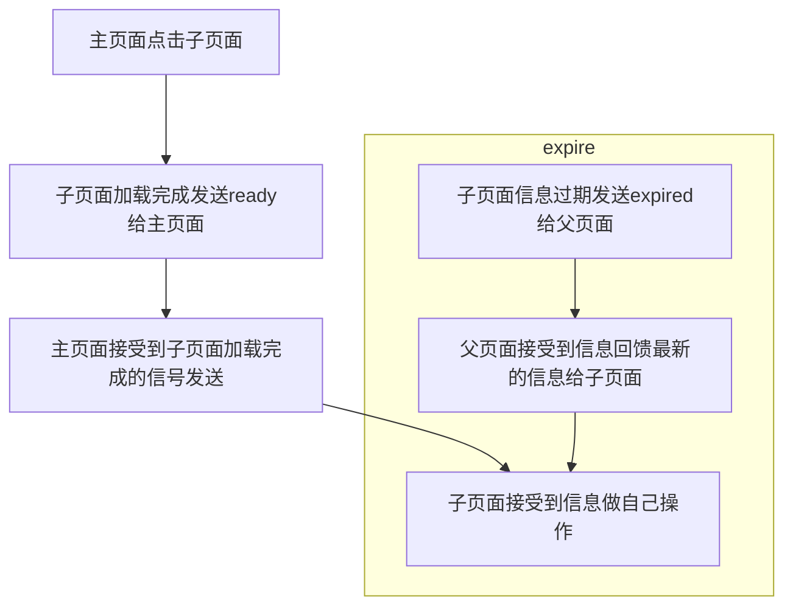
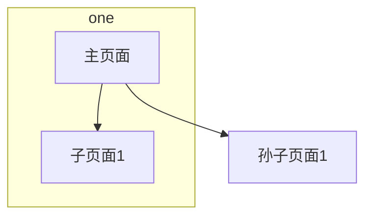

## 前言

在前端的开发中，经常会遇到这样的需求。A 项目中的某个页面或者新增一个模块，需要嵌入 B 项目。然后 B 项目有可能需要 C 项目这种套娃式的项目嵌套。如果你是新开始做项目，那么我推荐你使用[乾坤](https://qiankun.umijs.org/zh/guide)或者其他的微前端框架。但是如果你像我一样，项目以及成型，而且有很多公司自己的配置和域名不一样的各种各样的因素，导致你不能很好的使用微乾坤框架。那么通常大家使用的就是[iframe](https://developer.mozilla.org/zh-CN/docs/Web/HTML/Element/iframe)。

## 需求

这里说一下我的需求是要开发一个类似于移动应用的框架，框架的一侧需要加入每个项目的按钮，点击按钮打开对应的项目在右侧显示。由于种种因素的限制，我只能采用 iframe 来开发。还有负责每个项目的身份认证。这样该项目可以使用于多个环境下，例如 PC 的浏览器端，移动的 web 端。
总结下开发的需求

1. 一个类似于移动软件的应用外壳
2. 负责用户的验证，然后将用户信息告知各个子应用
3. 子应用告知主应用自己有哪几个模块，这样主应用可以渲染成 tab,切换子应用的页面

## 项目构建思路

需求 1 实际上很好实现，主要是需求 2 比较麻烦。为了让主应用(外壳应用)能和子应用进行通信，这里就用到了 iframe 的方法 postMessage。下面是 postMessage 的一个实例。

```javascript
// 父向子发送信息
// sonIframe 是通过document.getElementById('myIframe');获取的
sonIframe.contentWindow.postMessage(content, "/");

// 子向父发送信息
parent.postMessage(content, "/");

//适用于子和父页面的信息获取
window.addEventListener(
  "message",
  function (event) {
    if (event.origin !== "http://example.com") return;
    console.log("received message: " + event.data);
  },
  false
);
```

其实到这里感觉也就结束了。但是实际开发过程中遇到了很多麻烦的事情。

1. iframe 网页什么时候才加载完成，主应用可发送用户信息
2. 子应用的用户凭证过期了，需要告诉主应用，主应用获取用户信息再次发送给子应用。
3. 子应用合适向主应用发送信息，并且主应用得能接收到。

上面的难点就使得项目需要一个流程和交互的协议。
为此我设计了一个信息的类型:

```javascript
export const MsgType = {
  READY: "ready", // 告诉被发送信息的一方，我的页面已经加载完成
  MSG: "msg", // 告诉被发送信息的一方，我发送了一个信息给你
  EXPIRED: "expired", // 告诉被发送信息的一方，我过期了
};
```

并构建一个通信的流程



如果只有 `主页面-->子页面`2 层结构的话是比较简单的，但是还有一种情况是多层的，就是 `主页面-->子页面-->子页面的子页面`那就比较麻烦。
所以我们需要做一个操作，就是扁平化 iframe 页面的传递通信流程。**注意的是这里不能跨域**。



那么就需要子能找到对应的父页面，因为孙子页面嵌套了多层，它的父页面不是真正的外壳页面。这里我就在外壳页面中定义了一个对象，做一个标识符。

```javascript
// 获取自适应平台的window对象
export let platformParent = null;
export function getPlatformParent() {
  let top = window.top;
  let parent = window.parent;
  // 这里我也不知道会被嵌套几层，为了找到平台的window，发送消息。
  // 循环赋值parent, 如果最终parent == top。找到了浏览器的最外层，那就使用top发送信息

  // 所有的Iframe都会标注一个ID
  // console.log("自己本身被所包裹的Iframe", window.self);
  while (parent != top) {
    // 表明有多层嵌套
    if (
      parent.conf &&
      parent.conf.selfPlatform &&
      parent.conf.selfPlatform == "一个标识"
    ) {
      break;
    } else {
      parent = parent.parent;
    }
  }
  platformParent = parent;
}
```

获取到之后就可以通过这个 platformParent 对象发送信息，在发送信息的时候将子页面自己的页面标识发出去，这样外壳页面就能向对应的子页面发送信息了。

```javascript
window.self.frameElement.id; // 子页面向外壳页面发送信息的时候附带上这个信息
```

但是我在项目的多层交互中遇到一个问题就是，父页面不知道发送信息的子页面是处于哪一层。这样会导致一个问题，至少是在我的项目中会出现。因为我需要子项目的模块路由，由于无法知道当前信息中的路由是否是子项目的还是孙子项目的。导致渲染不正常也导致了 url 的调转中断了孙子页面的加载。
所以我在传递的信息中又加入了页面的层次标识

```javascript
export const IframeContext = {
  // 信息发送到哪一层
  GRANDPARENT: "grandparent", // 外层的外层
  PARENT: "parent", // 外层
};

// 判断我的父页面是外壳页面吗
export function isPostToGrandParent() {
  return platformParent == window.parent
    ? IframeContext.PARENT
    : IframeContext.GRANDPARENT;
}
```

这样获取到信息的时候外壳页面可以根据传递的值来判断是哪一层的页面发出的信息，从而阻断一些操作。

## 优化

这里主要说的是我认为的一些优化操作，因为监听信息使用的是 `window.addEventListener`函数，而且还有个回调函数。有时候会多次的绑定函数，我认为只需绑定一个而且多次绑定解绑浪费性能。所以可以使用代理的方式来做一个绑定函数

```javascript
function createInvoker(callback) {
  const invoker = (e) => invoker.value(e);
  invoker.value = callback;
  return invoker;
}
let invoker;
export function listenerMsg(baseHost, fn) {
  // window.onmessage = receiveMessage;
  function receiveMessage(event) {
    // 接受的data {retCode:200,data:{}}
    let origin = event.origin || event.originalEvent.origin;
    if (origin !== baseHost) return;
    // console.log("接受到父亲的信息", event.data);
    }
  }
  if (invoker) {
    window.removeEventListener("message", invoker);
  }
  invoker = createInvoker(receiveMessage);
  window.addEventListener("message", invoker, false);
}
```

我这里就做了一个封装来完成函数的回调和绑定解绑。外壳应用的代码和子应用的代码，除了对接受信息的判断操作不一样之外。流程是一样。


