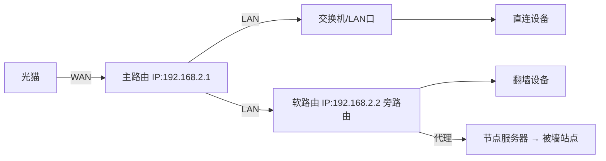
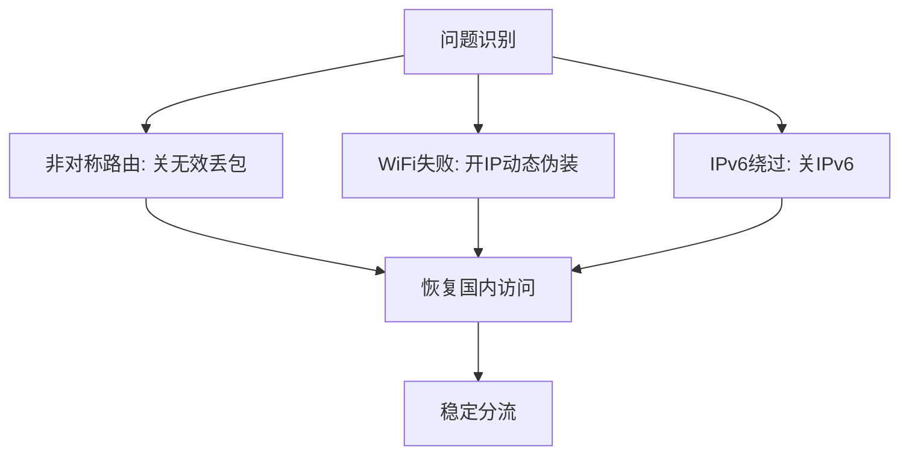

旁路由是一种备受争议的网络配置方式，本文将从其起源、定义到实际配置和问题解决进行讲解。跟随步骤，你将理解旁路由的核心，并学会在家庭网络中应用它。教学重点：概念清晰、步骤详尽、问题剖析。

## 为什么会有这个

旁路由的出现源于主路由模式的局限性。在主路由模式下，全家设备通过软路由实现科学上网，但存在几个关键问题：如果只需特定设备（如手机）翻墙，其他设备（如长辈手机）无需代理，则需手动调整每个代理工具的分流配置，操作繁琐且工具间差异大。改动主路由可能导致全家短暂或长时间断网。软路由运行多个插件时，易冲突，影响稳定性。作为互联网连接核心，主路由应避免这些风险。

旁路由解决了这些问题：不改变原有网络结构，仅在主路由旁接入一台刷OpenWRT的软路由，专责科学上网等额外功能。直连设备（如刷视频的手机）直接走主路由，避免折腾软路由时断网。翻墙设备数据先经软路由加密，转节点访问（如谷歌），主路由仅转发。结果：分工明确，稳定性提升。

然而，旁路由带来新问题：非对称路由导致无效数据包丢弃；WiFi设备访问国内站点失败；IPv6绕过代理，无法翻墙。这些问题使网络不稳定，尤其在复杂结构中。为什么存在争议？旁路由非标准拓扑，公共场合讨论易遭嘲讽，用法/叫法混乱（如旁路网关、透明代理）。争议根源：简单网络可用，但复杂场景（如IDC、BGP）易出奇葩问题，出错概率随复杂度上升。

## 这个是什么

旁路由指在主路由旁接入一台负责科学上网的路由设备。回顾家庭拓扑：宽带 → 光猫 → 主路由（WAN接光猫，PPPoE拨号得公网IP，如2.2.2.2）。主路由LAN口相当于交换机，IP如192.168.2.1，提供DHCP分配IP/网关。设备通过网线/WiFi连接交换机。

旁路由本质：刷OpenWRT的软路由，LAN口接主路由LAN，网关指向主路由。数据分流：直连设备走主路由；翻墙设备走旁路由代理。

类似概念：旁路网关、透明网关、透明代理、网关模式、网关代理。非路由系统（如安卓/Win/Linux跑V2Ray/Clash共享代理、Apple TV/Mac Mini、Surge网关模式）本质相同。只要设备开启IP转发，网关指向同段设备（再指向主路由），即旁路由变体。

此Mermaid图展示旁路由拓扑：主路由为核心，旁路由辅助分流。

## 该如何解决

### 配置旁路由基本结构

1. 查局域网网段（如192.168.2，网关192.168.2.1）。
2. 电脑网线插软路由LAN口（eth0/eth1试插）。获取IP，浏览器访默认网关（192.168.1.1），设密码。
3. 接口页：删WAN/WAN6。编辑LAN：静态IP改同主网段空闲（如192.168.2.2），网关/DNS设主路由192.168.2.1。DHCP默认开启。
4. 设备页：桥接eth1到br-lan（多网口用）。
5. 软路由LAN接主路由LAN。关主路由DHCP（品牌搜教程）。
6. 测试：软路由ping百度通。

### 安装插件实现科学上网

更新软件包列表，装luci-theme-argon、luci-app-ttyd。科学上网插件：Passwall（补依赖）、Homeproxy、OpenClash。导入节点/订阅，开启开关。

设备默认走主路由（租约未到期）。重启网卡/断WiFi重连，网关变旁路由IP。全设备翻墙。

### 小部分设备走直连，大部分走代理

OpenWRT dnsmasq支持按设备分网关。DHCP静态分配：列出租约（重启主路由刷新）。绑mac（WiFi列表查）：苹果IP 203，标签“direct”；安卓类似。

LAN DHCP高级：加“tag:direct,3,192.168.2.1”（网关主路由）、“tag:direct,6,192.168.2.1”（DNS）。保存应用。direct设备直连，其他翻墙。重连生效。

### 小部分设备走代理，大部分走直连

编辑安卓标签改“proxy”。删旧选项，加“tag:!proxy,3,192.168.2.1”（非proxy走主路由网关）、“tag:!proxy,6,192.168.2.1”（DNS）。

非proxy设备直连，proxy翻墙。灵活配置，按需分流。

### 解决旁路由带来的问题

* 非对称路由：三次握手百度，同意包绕旁路由，判无效。关防火墙“丢弃无效数据包”，恢复。但潜在追踪问题。
* WiFi国内访问失败：iptables/nftables记录五元组不NAT，源IP内网丢包。有线OK。解决：防火墙LAN区开“IP动态伪装”（masquerade，二次NAT）。源IP变旁路由IP，新流NAT。性能稍损，但关无效丢包也有效。
* IPv6绕过：默认网关主路由，访IPv6站不翻墙。关IPv6（开头配置），省烦恼。大部分用户无需IPv6。
* SYN泛洪防御：关不关随意，不影响转发，无公网暴露。

此Mermaid流程图概述问题解决路径：从识别到修复，确保旁路由可靠。

旁路由适合简单家庭网络；复杂场景避免。类似用法（如透明代理）本质相同。
