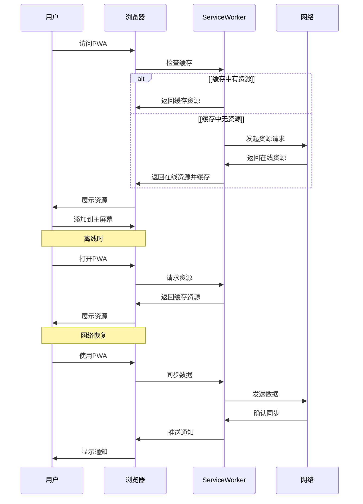

## 摘要

在现代 Web 开发的世界中，用户体验是最重要的因素之一。无论是 Web 应用还是原生应用，用户都期望应用能快速响应、操作流畅、具备离线能力，并能方便地访问。渐进式 Web 应用（PWA，Progressive Web App）的出现，正是为了满足这些需求。 PWA 是一种结合了 Web 应用和原生应用优点的技术，它不仅能够在 Web 上运行，还能提供类似于原生应用的用户体验。让我们一起来探索 PWA 的原理、核心技术以及它如何帮助我们构建更好的 Web 应用。

## 什么是 PWA

PWA，即渐进式 Web 应用，是一种利用现代 Web 技术开发的应用程序。它具备以下特点：

1. **渐进式**：PWA 可以在任何浏览器中运行，但在支持的浏览器中能提供更好的用户体验。
2. **响应式设计**：无论是手机、平板还是桌面设备，PWA 都能自适应各种屏幕尺寸。
3. **离线支持**：即使在无网络连接时，PWA 也能提供部分或全部功能。
4. **可安装**：用户可以像安装原生应用一样，将 PWA 添加到设备的主屏幕。
5. **安全**：PWA 必须在 HTTPS 协议下运行，确保用户数据的安全。

PWA 大致的交互过程如下图所示



## PWA 的核心技术

PWA 的实现依赖于以下几个核心技术：

### 1. Service Workers

Service Worker 是 PWA 的核心，它是一个运行在浏览器后台的独立线程，能够拦截和处理网络请求。Service Worker 具有以下功能：

- **缓存资源**：Service Worker 可以缓存应用的资源，如 HTML、CSS、JavaScript 文件，以及图片等，使得这些资源在离线时也能被访问。
- **离线支持**：通过 Service Worker，PWA 能够在用户无网络连接时，提供离线功能。
- **推送通知**：Service Worker 还能处理推送通知，即使用户未打开应用，也能接收到来自服务器的消息。

### 2. Web App Manifest

Web App Manifest 是一个 JSON 文件，用来描述 PWA 的元数据。这些元数据包括应用的名称、图标、启动 URL、显示模式等。通过这个文件，浏览器能够识别 PWA，并提供“添加到主屏幕”的选项。

例如，一个简单的 manifest.json 文件可能如下所示：

```json
json复制代码
{
  "name": "My Awesome PWA",
  "short_name": "PWA",
  "start_url": "/index.html",
  "display": "standalone",
  "background_color": "#ffffff",
  "theme_color": "#000000",
  "icons": [
    {
      "src": "/images/icon-192x192.png",
      "sizes": "192x192",
      "type": "image/png"
    }
  ]
}
```

### 3. Cache API

Cache API 允许 Service Worker 将应用资源缓存到本地，从而提高性能和离线可用性。开发者可以选择哪些资源需要缓存，并在用户请求时从缓存中返回这些资源。

### 4. Push Notifications

推送通知是 PWA 的一项重要功能。即使用户未打开应用，推送通知也能让他们及时接收到更新或消息。这项功能通过 Service Worker 来实现，与传统的 Web 应用相比，极大地增强了用户互动性。

## PWA 的局限性

尽管 PWA 有许多优点，但它也存在一些局限性：

- **浏览器支持不一致**：虽然大多数现代浏览器都支持 PWA，但在某些浏览器（如 Safari）中，支持可能不完全。
- **设备功能受限**：与原生应用相比，PWA 无法访问某些设备特定的功能，如传感器、蓝牙等。
- **缺乏应用商店的推广渠道**：PWA 无法直接通过应用商店进行分发，这可能会限制其曝光度和用户获取。


