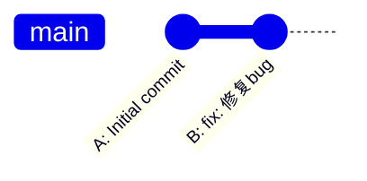
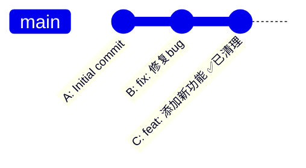
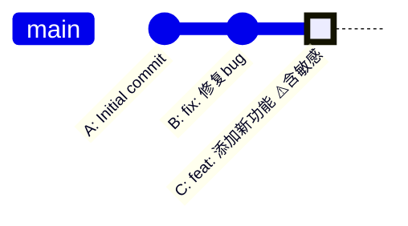
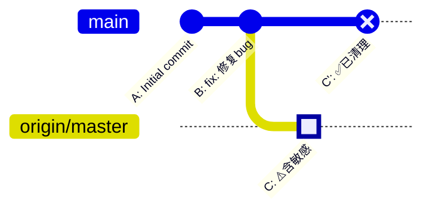
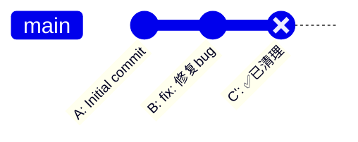
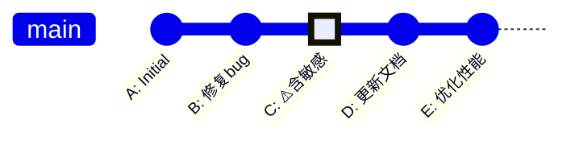
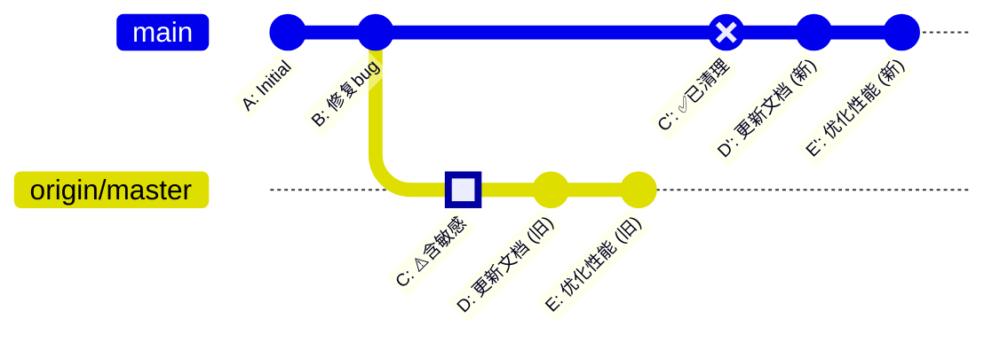
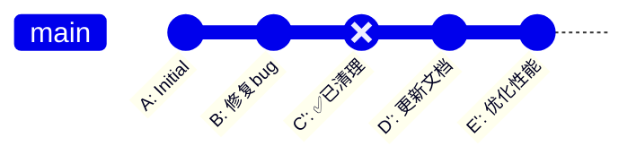
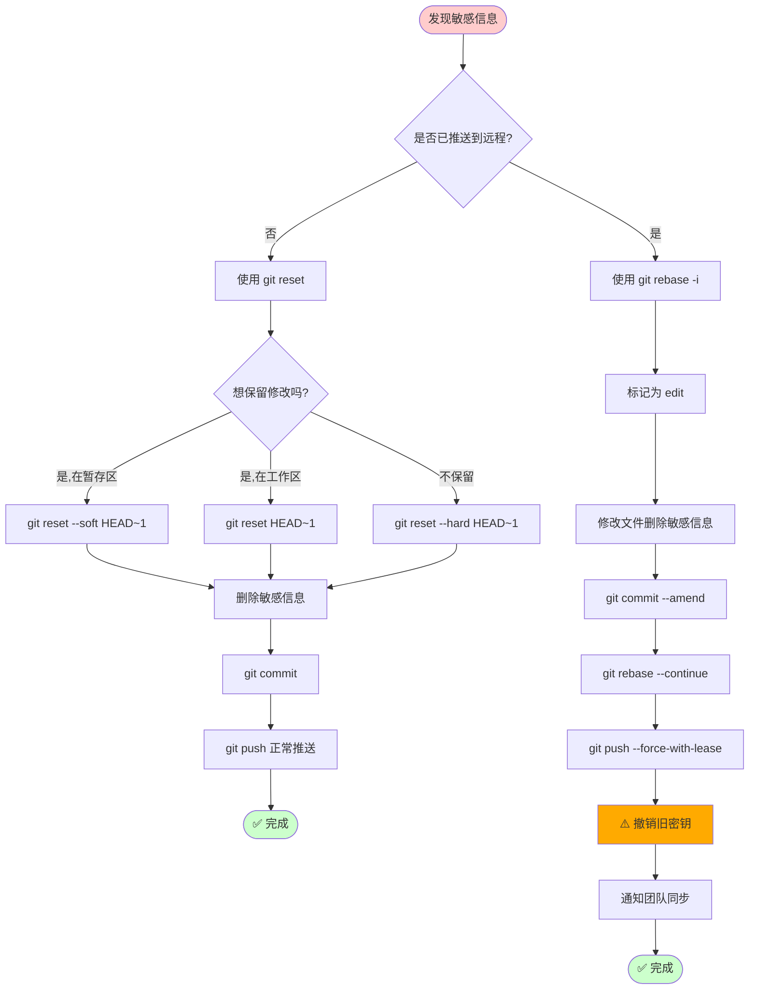

## 如何通过 `git rebase` 移除 GitHub 上的敏感信息

### 为什么要做这个？

在日常开发中，我们可能会不小心将敏感信息（如 API 密钥、密码等）提交到 GitHub 上。如果只是修改本地代码并重新提交，敏感信息依然存在于远程仓库的历史提交中。**`git rebase`** 允许我们修改历史提交，彻底从远程仓库中删除敏感信息。

---

## 两种场景的处理方式

### 场景 A：敏感信息**未推送**到远程（使用 `git reset`）

### 场景 B：敏感信息**已推送**到远程（使用 `git rebase`）

---

## 场景 A：敏感信息未推送到远程

### 步骤 1：本地撤销提交

刚提交完敏感信息，但**还没有 push 到远程**，可以直接撤销：

#### VSCode 操作方式

在 **VSCode** 的源代码管理面板中：

1. 点击 `...` 菜单
2. 选择 **提交** → **撤销上次提交**

#### Git 命令方式

根据需求选择合适的撤销方式：

**方式 1：保留文件修改在暂存区（推荐）**

```bash
git reset --soft HEAD~1
```

* ✅ 撤销提交
* ✅ 保留文件修改在暂存区（绿色状态）
* 适合：只是想修改提交信息或文件内容后重新提交

**方式 2：保留文件修改在工作区**

```bash
git reset --mixed HEAD~1
# 或简写为
git reset HEAD~1
```

* ✅ 撤销提交
* ✅ 保留文件修改在工作区（红色状态）
* ❌ 不在暂存区
* 适合：需要重新选择要提交的文件

**方式 3：完全丢弃修改（危险操作）**

```bash
git reset --hard HEAD~1
```

* ✅ 撤销提交
* ❌ 丢弃所有修改
* 适合：这次提交完全是错误的，想彻底清除

---

### 步骤 2：删除敏感信息并重新提交

**当前状态：**



使用 `git reset --soft HEAD~1` 后，包含敏感信息的提交 C 已被撤销，但文件修改还在。

**删除敏感信息并重新提交：**

```bash
# 1. 编辑文件删除敏感信息
vim config.js  # 删除 API_KEY = "secret123"

# 2. 重新提交
git add config.js
git commit -m "feat: 添加新功能（已移除敏感信息）"

# 3. 正常推送（不需要 --force）
git push origin master
```

**最终状态：**



✅ **场景 A 完成**：因为敏感信息从未推送到远程，所以没有留下任何痕迹！

---

## 场景 B：敏感信息已推送到远程

### 初始状态（最糟糕的情况）

你已经不小心将包含敏感信息的提交推送到了 GitHub：

**本地和远程状态（一致）：**



```bash
git log --oneline --graph --all
```

输出：

```
* d3a8f92 (HEAD -> master, origin/master) feat: 添加新功能 (含敏感信息)
* b7e4c51 fix: 修复bug
* a1b2c3d Initial commit
```

⚠️ **关键问题**：即使你在本地用 `git reset` 撤销提交，远程仓库的历史中仍然保留着敏感信息！

---

### 步骤 1：可选的本地撤销（但无法解决问题）

你可能尝试过：

```bash
git reset --soft HEAD~1
# 删除敏感信息
vim config.js
git add config.js
git commit -m "feat: 添加新功能（已移除敏感信息）"
```

**此时本地和远程的状态：**

```
本地 (master):           远程 (origin/master):
    ↓                           ↓
A → B → D (已清理)       A → B → C (⚠️含敏感)

问题：远程历史中的 C 提交仍然存在！
```

如果你尝试推送：

```bash
git push origin master
```

会收到错误：

```
! [rejected]        master -> master (non-fast-forward)
error: failed to push some refs to 'origin'
hint: Updates were rejected because the tip of your current branch is behind
```

❌ **这种方式无法删除远程历史中的敏感信息！**

---

### 步骤 2：使用 `git rebase -i` 修改远程历史

正确的做法是直接修改历史提交：

```bash
git rebase -i HEAD~1
```

**编辑器中显示：**

```
pick d3a8f92 feat: 添加新功能
```

**将 `pick` 改为 `edit`：**

```
edit d3a8f92 feat: 添加新功能
```

保存并关闭编辑器。

---

### 步骤 3：修改提交内容

Git 会停在该提交处：

```bash
# 1. 编辑文件删除敏感信息
vim config.js  # 删除 API_KEY = "secret123"

# 2. 暂存修改
git add config.js

# 3. 修改当前提交
git commit --amend -m "feat: 添加新功能（已移除敏感信息）"

# 4. 继续 rebase
git rebase --continue
```

**此时本地和远程出现分叉：**



**查看此时的分叉状态：**

```bash
git log --oneline --graph --all
```

输出：

```
* e5f6a78 (HEAD -> master) feat: 添加新功能（已移除敏感信息）
| * d3a8f92 (origin/master) feat: 添加新功能 (含敏感信息)
|/
* b7e4c51 fix: 修复bug
* a1b2c3d Initial commit
```

**关键理解：**

* 本地 `master` 分支 → 新提交 `e5f6a78`（已清理）
* 远程 `origin/master` → 旧提交 `d3a8f92`（含敏感信息）
* 两条历史从 `B` 提交开始分叉

---

### 步骤 4：强制推送覆盖远程历史

⚠️ **警告**：此操作会覆盖远程历史，请确保团队成员知晓！

```bash
# 推荐：更安全的强制推送
git push origin master --force-with-lease

# 或使用简写
git push -f origin master  # 不太安全
```

**`--force-with-lease` 的作用：**

* 如果远程有其他人的新提交，推送会被拒绝
* 避免意外覆盖他人的工作

**推送后远程被覆盖：**



**查看最终状态：**

```bash
git log --oneline --graph --all
```

输出：

```
* e5f6a78 (HEAD -> master, origin/master) feat: 添加新功能（已移除敏感信息）
* b7e4c51 fix: 修复bug
* a1b2c3d Initial commit
```

✅ **远程的旧提交 `d3a8f92` 已被完全覆盖！**

---

## 更复杂的场景：修改历史中间的提交

假设敏感信息不在最新提交，而在历史中间：

**初始状态：**



**操作步骤：**

```bash
# 1. Rebase 到 C 的父提交（B）
git rebase -i B

# 或使用相对引用（修改最近 3 个提交）
git rebase -i HEAD~3
```

**编辑器中显示：**

```
pick C 添加功能 (含敏感信息)
pick D 更新文档
pick E 优化性能
```

**将 C 标记为 edit：**

```
edit C 添加功能
pick D 更新文档
pick E 优化性能
```

**修改并继续：**

```bash
# 修改文件
vim config.js
git add config.js
git commit --amend -m "C: 添加功能（已移除敏感信息）"

# 继续 rebase（D 和 E 会自动重新应用）
git rebase --continue
```

**Rebase 后本地与远程的分叉：**



**查看分叉状态：**

```bash
git log --oneline --graph --all
```

输出：

```
* f9a2b34 (HEAD -> master) E: 优化性能
* e8c1d23 D: 更新文档
* d7b0a12 C: 添加功能（已移除敏感信息）
| * 5e4f3g2 (origin/master) E: 优化性能
| * 4d3e2f1 D: 更新文档
| * 3c2d1e0 C: 添加功能 (含敏感信息)
|/
* b7e4c51 B: 修复bug
* a1b2c3d A: Initial
```

⚠️ **重要**：C 之后的所有提交（D、E）都会获得新的 commit ID，因为它们的父提交改变了！

**强制推送：**

```bash
git push origin master --force-with-lease
```

**最终状态：**



---

## 完整流程对比图

### 场景 A：未推送（使用 reset）

```
步骤1: 撤销提交
A → B → C (含敏感)
         ↓ git reset --soft HEAD~1
A → B    (C 的修改在暂存区)

步骤2: 删除敏感信息并重新提交
A → B → C' (已清理)
         ↓ git push
远程: A → B → C' (已清理) ✅

结论：远程从未看到过敏感信息
```

### 场景 B：已推送（使用 rebase）

```
步骤1: 初始状态
本地:  A → B → C (含敏感)
远程:  A → B → C (含敏感)

步骤2: Rebase 修改历史
本地:  A → B → C' (已清理)
              ↗ 分叉
远程:  A → B → C (⚠️仍含敏感)

步骤3: 强制推送覆盖
本地:  A → B → C' (已清理)
远程:  A → B → C' (已清理) ✅

结论：远程旧提交被覆盖，但需要注意：
- 已经 clone 的仓库仍可能有旧历史
- GitHub 缓存可能短期内仍可访问
```

---

## `git reset` 三种模式对比

| 模式            | 命令                        | 撤销提交 | 暂存区  | 工作区  | 适用场景                     |
| --------------- | --------------------------- | -------- | ------- | ------- | ---------------------------- |
| **soft**  | `git reset --soft HEAD~1` | ✅       | ✅ 保留 | ✅ 保留 | 想修改提交信息或内容         |
| **mixed** | `git reset HEAD~1`        | ✅       | ❌ 清空 | ✅ 保留 | 想重新选择要提交的文件       |
| **hard**  | `git reset --hard HEAD~1` | ✅       | ❌ 清空 | ❌ 清空 | 这次提交完全错误，想彻底放弃 |

**示例对比：**

```bash
# 假设你提交了 3 个文件：config.js, api.js, utils.js
git add config.js api.js utils.js
git commit -m "feat: 添加配置"

# --soft: 3 个文件都在暂存区（绿色）
git reset --soft HEAD~1
git status
# Changes to be committed:
#   modified:   config.js
#   modified:   api.js
#   modified:   utils.js

# --mixed: 3 个文件都在工作区（红色）
git reset HEAD~1
git status
# Changes not staged for commit:
#   modified:   config.js
#   modified:   api.js
#   modified:   utils.js

# --hard: 3 个文件的修改全部丢失
git reset --hard HEAD~1
git status
# nothing to commit, working tree clean
```

---

## 查看提交树的命令

类似 VSCode/IDE 的树形视图：

```bash
# 基础版本
git log --oneline --graph --all

# 美化版本
git log --graph --pretty=format:'%Cred%h%Creset -%C(yellow)%d%Creset %s %Cgreen(%cr) %C(bold blue)<%an>%Creset' --abbrev-commit --all

# 创建别名（推荐）
git config --global alias.tree "log --graph --oneline --decorate --all"
git tree

# 显示本地和远程分叉
git log --oneline --graph --all --decorate
```

**输出示例（显示分叉）：**

```
* e5f6a78 (HEAD -> master) feat: 新功能（已清理）
| * d3a8f92 (origin/master) feat: 新功能 (含敏感信息)
|/
* b7e4c51 fix: 修复bug
* a1b2c3d Initial commit
```

---

## 重要注意事项

### 1. ⚠️ 强制推送的风险

```bash
# ✅ 推荐：更安全
git push origin master --force-with-lease
# 如果远程有新提交会拒绝推送

# ❌ 不推荐：直接覆盖
git push origin master --force
# 会覆盖所有远程更改
```

### 2. 🔐 务必撤销暴露的密钥

即使从 Git 历史删除，密钥可能已被：

* ✅ GitHub 服务器缓存（短期内仍可访问）
* ✅ 其他协作者克隆的本地仓库
* ✅ CI/CD 构建日志
* ✅ GitHub Actions 的日志

**必须立即：**

1. 撤销旧密钥/令牌
2. 生成新密钥
3. 更新所有使用该密钥的服务
4. 检查访问日志是否有异常

### 3. 👥 通知团队成员同步

其他协作者本地仍有旧历史，需要同步：

```bash
# 方式 1：强制同步（简单但会丢失本地未推送的提交）
git fetch origin
git reset --hard origin/master

# 方式 2：将本地提交 rebase 到新历史上（推荐）
git fetch origin
git rebase origin/master
```

### 4. 🛠️ 深度清理工具

对于更复杂的场景（多个分支、多个文件、整个目录）：

```bash
# BFG Repo-Cleaner（速度快，推荐）
bfg --delete-files secrets.txt
bfg --replace-text passwords.txt
bfg --delete-folders .env

# git filter-repo（功能强大）
git filter-repo --path secrets.txt --invert-paths
git filter-repo --replace-text expressions.txt
```

---

## 决策流程图



---

## 总结

| 场景           | 方法           | 命令                          | 需要 `--force` |
| -------------- | -------------- | ----------------------------- | ---------------- |
| 敏感信息未推送 | `git reset`  | `git reset --soft HEAD~1`   | ❌ 否            |
| 敏感信息已推送 | `git rebase` | `git rebase -i`+`--amend` | ✅ 是            |

**核心原则：**

* 本地问题用 `reset`，简单快捷
* 远程问题用 `rebase`，修改历史
* 务必撤销暴露的密钥，删除历史只是第一步
* 使用 `git log --graph --all` 查看本地和远程的分叉状态
