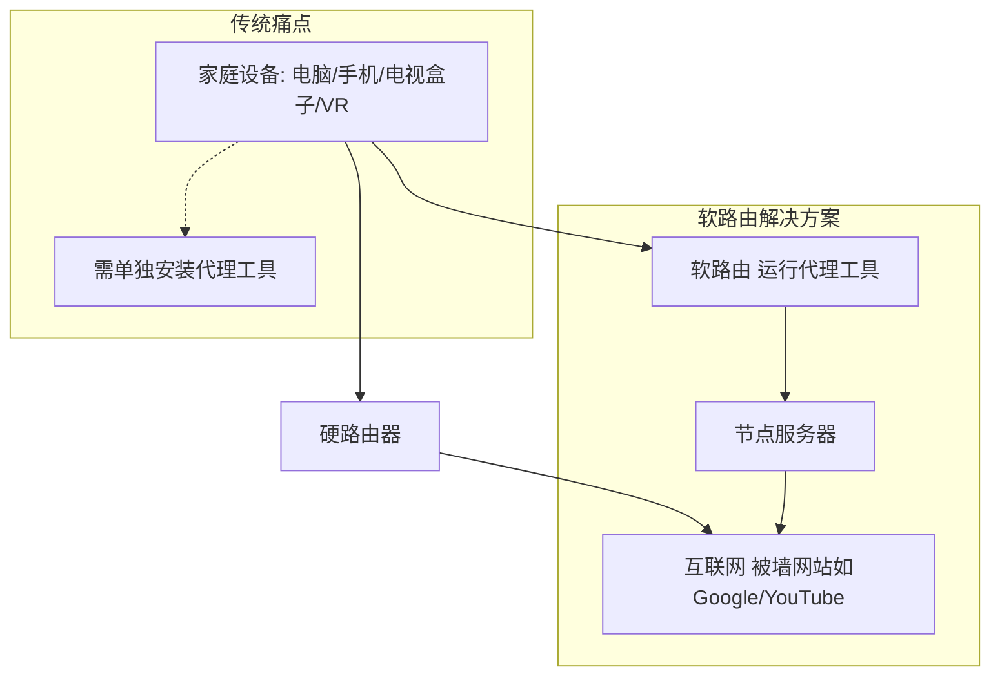
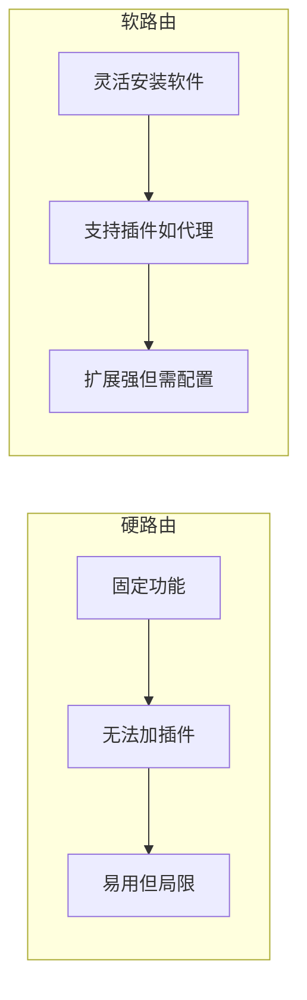
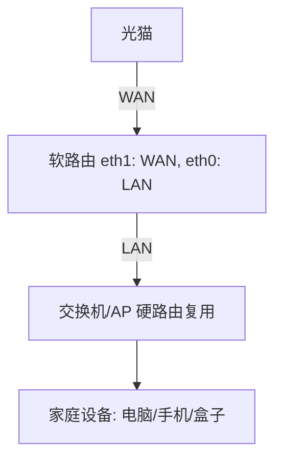
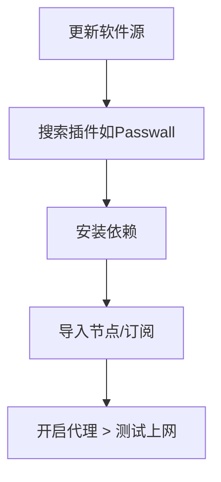

如果你是个网络小白，从来没接触过路由器进阶玩法，却又想实现全家设备科学上网（俗称翻墙），让手机、电脑、电视盒子甚至VR头显都能轻松访问Google、YouTube和Instagram，那这篇文章绝对是为你量身定制的。我们将从零开始，用最通俗的语言一步步拆解：为什么要软路由？什么是软路由？以及小白怎么上手软路由？读完这篇，你就能自信地组装自己的软路由系统了。别担心，我们会结合图表和实际例子，让一切变得简单易懂。

## 为什么要软路由？

先来聊聊为什么需要软路由。想象一下你的家庭网络：路由器是所有设备的“出口”，电脑、手机、电视盒子、游戏机和VR头显都通过它连接互联网。但当你想访问被墙的网站（如Google或YouTube）时，问题就来了。

* **传统科学上网的痛点**：通常，你需要在每台设备上单独安装代理工具（如V2Ray、Clash或小火箭）。比如，用手机访问Google时，数据会先加密发给海外节点服务器，节点帮你访问后再加密返回。这有效，但如果你用电视盒子看YouTube呢？很多盒子不支持代理工具，导致无法访问。VR头显激活需要访问Facebook，也可能卡壳。更别提跨境电商需要管理上百台设备了——每个都装代理？太麻烦！
* **临时解决方案的局限**：你可以把手机或电脑的代理共享给其他设备，但这有前提（如设备兼容性），不通用。结果：全家上网不顺畅，隔壁小美想蹭网都得羡慕你。

软路由的出现，就是为了解决这些痛点。它让路由器本身运行代理工具，所有设备的数据经过路由器时自动加密转发到节点。这样，全家设备连上路由器，就能科学上网——无需每台设备单独配置！这不只方便，还省时省力，尤其适合普通家庭或小工作室。

为了直观理解家庭网络的痛点，这里用Mermaid图展示传统网络 vs. 软路由网络的对比：

如图，软路由像一个智能关卡，直接处理所有流量，实现无缝科学上网。

## 什么是软路由？

软路由不是某个具体产品，而是一种“可安装软件的路由器”。简单说，它把普通硬件变成路由器，通过软件定义功能。相比之下：

* **硬路由**：你在网上买的家用路由器（如小米或TP-Link），功能固定，只能基本路由，无法加新插件。系统固化在闪存芯片上，刷机风险高。
* **软路由**：用迷你PC、工控主机、闲置笔记本或开发板，安装路由系统（如OpenWRT）。它灵活，能加插件（如代理工具），实现科学上网、虚拟化等。形态多样：安装Windows就是电脑，安装OpenWRT就是路由器。

常见路由系统有OpenWRT（简称OP）、PFsense、ROS、爱快、梅林等。我们重点聊热度最高的OpenWRT：开源免费，提供完整路由功能，支持插件安装。特に适合科学上网。

软路由硬件平台分两种：

* **嵌入式设备**（如硬路由刷机）：需检查官网支持（如小米AX6000可刷OP），但闪存小，扩展差，新手易变砖。
* **X86/ARM平台**（如小主机）：推荐新手用，系统装在SD卡/U盘，易更换。

软路由 vs. 硬路由的区别用Mermaid表格展示：

总之，软路由是硬路由的“升级版”，让路由器从“哑巴”变“智能”。

## 小白怎么上手软路由？

好了，理论够了，现在进入实战！我们用教学风格，一步步教你从选硬件到配置，实现全家科学上网。重点用ImmortalWRT（OpenWRT分支，插件丰富）作为固件。假设你预算300-800元，网络需求千兆以内。

### 1. 选硬件

* **需求**：至少两个网口（WAN/LAN），按带宽选（千兆够用）。
* **推荐**：
  * 预算低：NanoPi R2S (ARM，250元，省电<2W，无WiFi需AP)。
  * 中等：红米AX6000 (硬路由刷机，350元，有WiFi)。
  * 高端：X86小主机 (如N100 CPU，850元，扩展强)。
* 检查兼容：官网搜型号，确保支持OpenWRT。

硬件拓扑图：

### 2. 获取并刷入固件

* **途径**：推荐ImmortalWRT纯净固件（官网下载23.05版本，避免新版坑）。
* **刷机工具**：Rufus (Windows) 或 balenaEtcher (Mac/Linux)。
* **步骤**：
  1. 下载固件（X86选img.gz，ARM选ext4/squashfs）。
  2. 插SD卡/U盘，用工具写入固件。
  3. 插卡/盘到主机，通电启动（X86进BIOS设U盘优先）。

### 3. 配置网络

* **接入**：电脑连软路由LAN口（eth0），浏览器访192.168.1.1 (root/空密码)。
* **基本设置**：
  * 关IPv6（接口 > 删除WAN6，LAN禁用IPv6）。
  * 设密码，桥接多网口到br-lan。
  * WAN设DHCP或PPPoE拨号（改光猫桥接模式，避免双NAT）。
  * 改LAN IP为192.168.2.1，避免冲突。
* **复用硬路由作AP**：关DHCP，LAN连LAN，设同网段IP（如192.168.2.191）。

### 4. 安装插件，实现科学上网

* 系统 > 软件包 > 更新列表。
* 安装：luci-theme-argon (主题)、luci-i18n-ttyd-zh-cn (终端)。
* 科学上网插件（选一）：
  * **Passwall**：加订阅链接，选节点，开启主开关。
  * **Homeproxy**：导入订阅，选节点，应用。
  * **OpenClash**：下载内核，加订阅，启动。
* 测试：访问Google，若失败查日志，重启路由。

插件安装流程图：

注意：同一时只跑一款插件，避免冲突。硬路由刷机慎重，新手优先小主机。
