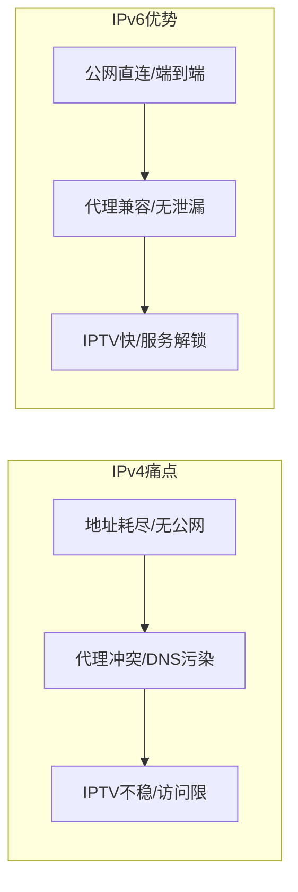
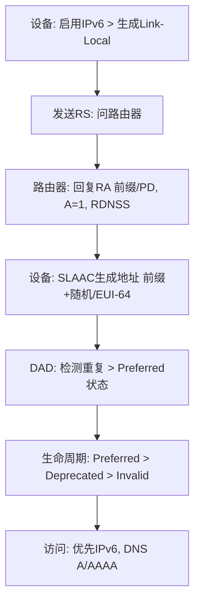
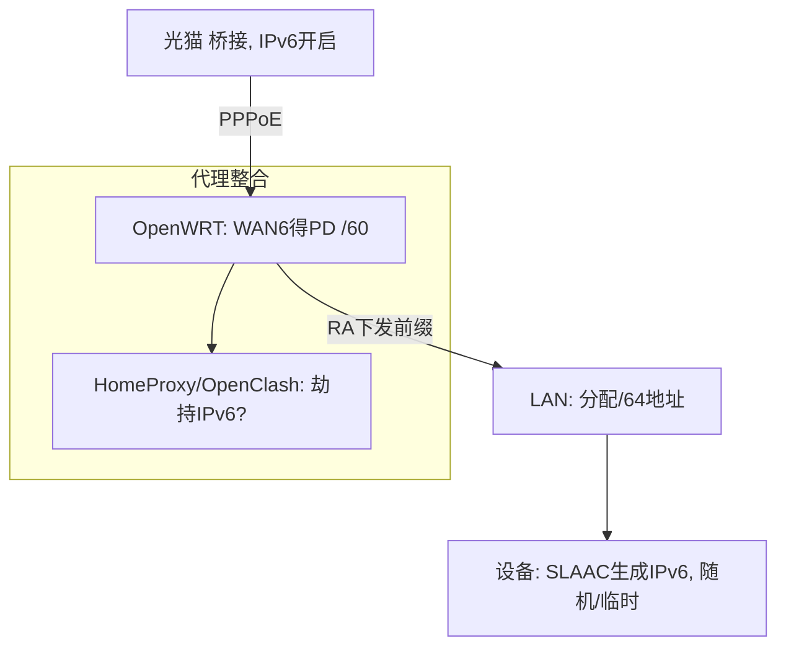

今天我们来深入浅出地聊聊IPv6这个话题。如果你是个软路由爱好者，想在OpenWRT上启用IPv6实现公网访问家庭设备、看IPTV，却又担心与科学上网代理插件（如HomeProxy/Sing-Box、OpenClash/Mihomo）冲突，导致分流异常、DNS污染或访问慢，这篇教程就是你的救星。我们将用教学风格，从零起步，一步步拆解：为什么需要IPv6？IPv6是什么及其工作流程？以及如何在OpenWRT软路由上配置IPv6，并与代理插件无缝兼容。读完后，你能自信地处理IPv6环境，避免奇妙“化学反应”。注意，本教程基于ImmortalWRT 23.05固件（兼容最新OpenWRT分支），OpenClash v0.47.001（2025年8月发布，优化IPv6支持）， HomeProxy v1.43（2025年7月发布，Sing-Box内核）， Sing-Box v1.12.12（2025年10月最新，修复QUIC内存泄漏）， Mihomo（Clash Meta）集成于OpenClash。走起！

## 为什么需要IPv6？

先来聊聊为什么会有IPv6配置需求。IPv4地址耗尽已成现实，许多运营商不再分配公网IPv4，转而推广IPv6。但在软路由科学上网环境中，IPv6往往被忽略或禁用，导致痛点：

* **公网访问难题**：想远程访问家里的NAS、监控或服务器？无公网IPv4，只能靠内网穿透（如FRP），麻烦且不稳。IPv6提供公网地址，直连访问，零成本。
* **IPTV/专有服务**：用户反馈，IPv6源的IPTV更稳更快；廉价VPS只给IPv6地址，无IPv6就访问不了。
* **代理冲突**：启用IPv6后，HomeProxy/OpenClash等插件若配置不当，IPv6流量绕过代理，导致DNS泄漏/污染（运营商检测）、分流异常（国内网站走代理慢）、或黑名单网站（如Google）无法访问。IPv4/IPv6双栈混用，易产生“化学反应”。

IPv6的出现，就是为了解决IPv4地址短缺，并提升网络效率。但在代理环境中，它需优化：不冲突科学上网，实现端到端直连。尤其适合隐私党、家庭服务器用户和IPTV爱好者。忽略IPv6？错过公网便利；乱配？代理崩盘。配置好后，全家设备公网IPv6+无缝翻墙，完美！

痛点对比用Mermaid表格展示：

如图，IPv6补齐IPv4短板，但需正确配置。

## IPv6是什么？

IPv6（Internet Protocol version 6）是下一代互联网协议，地址128位（比IPv4的32位多得多），解决地址短缺，支持自动配置、无状态地址（SLAAC）。在软路由（如OpenWRT）上，它的工作流程涉及RS/RA、PD、生命周期等，与代理插件交互时需注意劫持/分流。

* **基本概念**：地址格式如2001:db8::1，前64位前缀（运营商分配），后64位接口ID（EUI-64或随机）。链路本地（fe80::）用于局域网；全球单播（2xxx::）公网。PD（Prefix Delegation）：运营商委托前缀给路由器，下发给设备。
* **工作流程**：设备启用IPv6后，发送RS（Router Solicitation）问“谁是路由器？”。路由器回复RA（Router Advertisement），含前缀、标志（A=1启用SLAAC）。设备用前缀+后缀生成地址，进行DAD（Duplicate Address Detection）检测重复。地址生命周期：Preferred（首选，可新连接）、Deprecated（弃用，仅旧连接）、Invalid（失效删除）。临时地址随机更换，防追踪。
* **DNS与代理**：IPv6 DNS用AAAA记录；RA可携RDNSS（DNS服务器），但兼容差。代理插件如Sing-Box（RealIP模式自然支持IPv6）、Mihomo（FakeIP需额外配置）需劫持IPv6流量，避免绕过分流。
* **隐私与生成**：EUI-64用MAC+FF:FE，易追踪；现代系统随机后缀+临时地址。

IPv6工作流程用Mermaid图展示（简化RS/RA+SLAAC）：

如图，IPv6自动配置高效，但代理中易漏流量。

## 该如何解决？

好了，实战时间！我们用ImmortalWRT 23.05配置IPv6（前提：关闭代理插件/第三方DNS）。分常见场景：桥接/路由模式、PD可用/无PD。目标：IPv6上网+代理不冲突（Sing-Box RealIP优雅，Mihomo FakeIP需慎劫持）。

### 1. 基本IPv6配置（无代理）

* **全局设置**：网络 > 接口 > 全局网络选项 > 清空ULA前缀。DNS > 高级 > 取消“过滤IPv6解析”。保存应用。
* **桥接模式（路由拨号）**：WAN6（DHCPv6）自动获取PD（e.g., /60）。LAN > 高级 > 分配长度64，后缀EUI-64或自定义。IPv6设置 > RA服务模式，关本地DNS。RA设置 > 关O标记。保存应用。设备重启网卡，得公网IPv6。
* **路由模式（二级路由）**：加WAN6接口（DHCPv6，设备WAN）。若得PD，同上配置LAN；无PD，用中继（WAN6: RA中继，DHCP禁用，NDP中继；LAN: RA/NDP中继）。极端无PD（/128）：设ULA前缀，防火墙WAN > 高级 > 启用IPv6伪装（NAT66）。
* 测试：ipconfig/all查地址，访ipv6-test.com。优先桥接得PD，避免NAT。

网络拓扑用Mermaid图（桥接+PD）：

### 2. 与代理插件兼容（科学上网不冲突）

* **HomeProxy (Sing-Box)**：节点设置 > 加订阅。客户端 > 主节点 > 路由自定义 > DNS策略默认（得IPv6地址）。关IPv6支持（IPv6直连绕过）；需代理IPv6？开IPv6支持+覆盖目标地址（Sniff覆写解锁奈飞）。绕过中国流量（国内IPv6直连）。测试：访Google（IPv4代理），百度（IPv6直连）。Sing-Box RealIP自然兼容，无污染。
* **OpenClash (Mihomo/Clash Meta)**：插件设置 > IPv6 > 允许IPv6解析 > 应用。关IPv6流量代理（FakeIP限场景）。测试：DNS得FakeIPv4，Clash用IPv6访问（NAT效果）。需代理IPv6？慎开劫持，仅劫持纯IPv6流量。
* **通用优化**：DNS策略IPv4（禁IPv6解析，避免冲突）；节点支持IPv6再代理（否则失败）。公网服务用设备IPv6；直连IPv6地址无影响。

配置后：IPv6公网访问+翻墙无缝。日志查连接（WebUI）。若冲突：关IPv6支持，直连IPv6。
