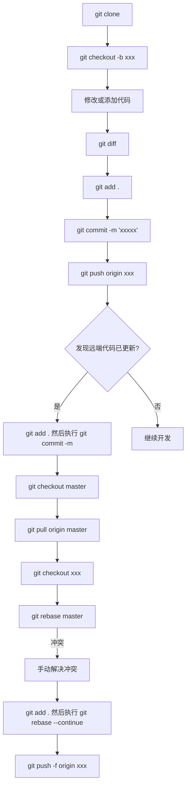

## 摘要

在日常工作和学习中，会遇到多人开发项目。项目的合并往往是一个大问题。在多人开发中采用 Git 管理代码，如果没有一个良好的 Git 工作流程，项目维护起来将变得极其困难。恰巧之前看到一位大佬的视频，介绍了一套 Git 上多人开发的工作流程。结合自己的实际工作环境，我做了一些总结。

## 操作流程

1. `git clone` // 克隆到本地
2. `git checkout -b xxx` 切换至新分支（相当于复制了远程仓库到本地并创建 xxx 分支）
3. 修改或添加本地代码（对硬盘上的源文件进行修改）
4. `git diff` 查看自己对代码做出的改变
5. `git add .` 将更新后的代码上传至暂存区
6. `git commit -m "xxxxx"` 将暂存区中的更新提交至本地 Git
7. `git push origin xxx` 将本地的 xxx 分支推送至 GitHub 上的 Git

### 如果在编写代码过程中发现远端代码已更新

1. `git add .` 和 `git commit -m ""` 先保存本地代码，进行一次本地提交，不做线上提交
2. `git checkout master` 切换回 master 分支
3. `git pull origin master` 将远端修改过的代码更新到本地
4. `git checkout xxx` 回到 xxx 分支
5. `git rebase master` 在 xxx 分支上将 master 分支内容移过来，根据自己的 commit 进行合并（可能会出现 rebase conflict，需要手动选择保留的代码）
   - 如果合并有问题并想放弃合并，可以使用 `git rebase --abort` 丢弃合并的内容
6. `git add .` 然后执行 `git rebase --continue`（如果出现需要手动解决冲突的情况，解决后保存并退出，执行这条命令）
7. `git push -f origin xxx` 强制推送更新后的代码到远端
8. 项目负责人采用 pull request 中的 squash and merge 来合并所有不同的 commit

### 完成远端合并后

1. `git branch -d xxx` 删除本地分支 xxx
2. `git pull origin master` 将远端的最新代码拉至本地



在多人合作中，通过上述流程可以更好地管理分支和代码冲突，确保开发效率和代码的整洁度。

## 名词解释

为了帮助 Git 新手理解一些常用的指令，下面是对视频中出现的指令及其含义的整理：

- `git checkout -b xxx`：`git checkout xxx` 是切换到 xxx 分支，`b` 意味着创建新分支，因此这条指令的意思是创建并切换到 xxx 分支。
- `git diff`：查看暂存区与工作区文件的差异。
- `git add xxx`：将 xxx 文件添加到暂存区。
- `git commit`：将暂存区内容提交到当前分支。
- `git push <RemoteHostName> <LocalBranchName>`：将本地分支推送到远程主机的同名分支（若加 `f` 表示强制推送）。
- `git pull <RemoteHostName> <RemoteBranchName>`：从远程主机下载指定分支并与本地同名分支合并。
- `git rebase xxx`：假设当前分支与 xxx 分支存在共同部分 common，该指令将 xxx 分支的内容包括 common 在内替换当前分支的 common 部分。
- `git branch -D xxx`：强制删除本地分支 xxx。

## Git 拉取指定的提交记录（用于合并出错的紧急情况）

1. 克隆远程仓库到本地：`git clone [地址]`，例如 `git clone <https://github.com/aa/bb.git`>
2. 查看提交记录的 ID：`git log --pretty=oneline`，显示每个提交记录的简短信息和 ID
3. 创建一个新的分支并切换到该分支：`git checkout -b [分支名] [提交ID]`，例如 `git checkout -b master 2342dsfsdfs2`
4. 可在本地分支上查看或修改代码，若要推送到远程仓库使用 `git push origin`

## Git 拉取指定的分支

在 Git 中，如果想拉取特定分支的代码到本地，可以使用以下命令：

```
git clone -b <branch-name> --single-branch <repository-url>
```

例如：

```
git clone -b develop --single-branch <https://github.com/用户名/仓库名.git>
```

这样只有指定的分支会被克隆到本地。如果已经克隆整个仓库或在现有本地仓库中工作，可以使用 `git fetch origin` 和 `git checkout <branch-name>` 来切换到指定分支。

## GitHub 提交规范

```
<type>(<scope>): <subject>
```

1. **type 类型（必须）**| 代码     | 
   | -------- | ------------------------ |
   | feat     | 新功能                   |
   | fix      | 修复                     |
   | docs     | 文档注释                 |
   | style    | 代码格式                 |
   | refactor | 重构、优化               |
   | perf     | 性能优化                 |
   | test     | 增加测试                 |
   | chore    | 构建过程或辅助工具的变动 |
   | revert   | 回退                     |
   | build    | 打包                     |
2. **scope（可选）**
   scope 用于说明 commit 影响的范围，比如数据层、控制层等。
3. **subject（必须）**
   简短描述 commit 目的，不超过 50 个字符。
   示例：
   ```
   fix(NextCanvas.vue): 画布放大缩小逻辑
   feat(NextCanvas.vue): 画布导出图片压缩
   ```

### 添加多个 Emoji 图标

```
git commit -m '<type>(<scope>): :emoji1: :emoji2: :emoji3: 提交说明'
```

| emoji       | 代码       | 说明                  |
| ----------- | ---------- | --------------------- |
| 🎨 (调色板) | `:art:`  | 改进代码结构/代码格式 |
| ⚡️ (闪电) | `:zap:`  | 提升性能              |
| 🔥 (火焰)   | `:fire:` | 移除代码或文件        |
| 🐛 (bug)    | `:bug:`  | 修复 bug              |
| 📝 (备忘录) | `:memo:` | 撰写文档              |

## 常见 Git 分支命名规范

- **master/master**：主分支，用于发布稳定版本，不能直接在该分支上开发。
- **develop**：开发分支，用于日常开发，所有 feature 分支都从该分支创建，也是最终合并到 master/master 分支的来源。
- **feature/{feature_name}**：功能分支，用于开发新功能或修复 bug。
- **hotfix/{issue_number}**：修补分支，用于紧急修复问题，一般从 master/master 分支创建。
- **release/{version_number}**：预发布分支，用于发布前的测试和准备工作。

命名规范可以根据团队的实际情况进行调整，但应保持可读性和清晰性。


