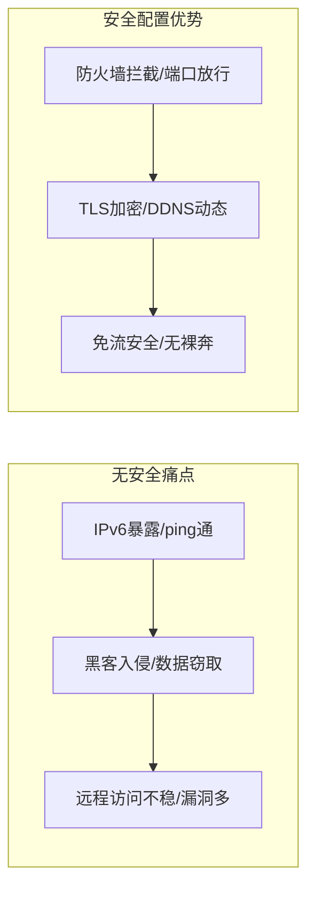
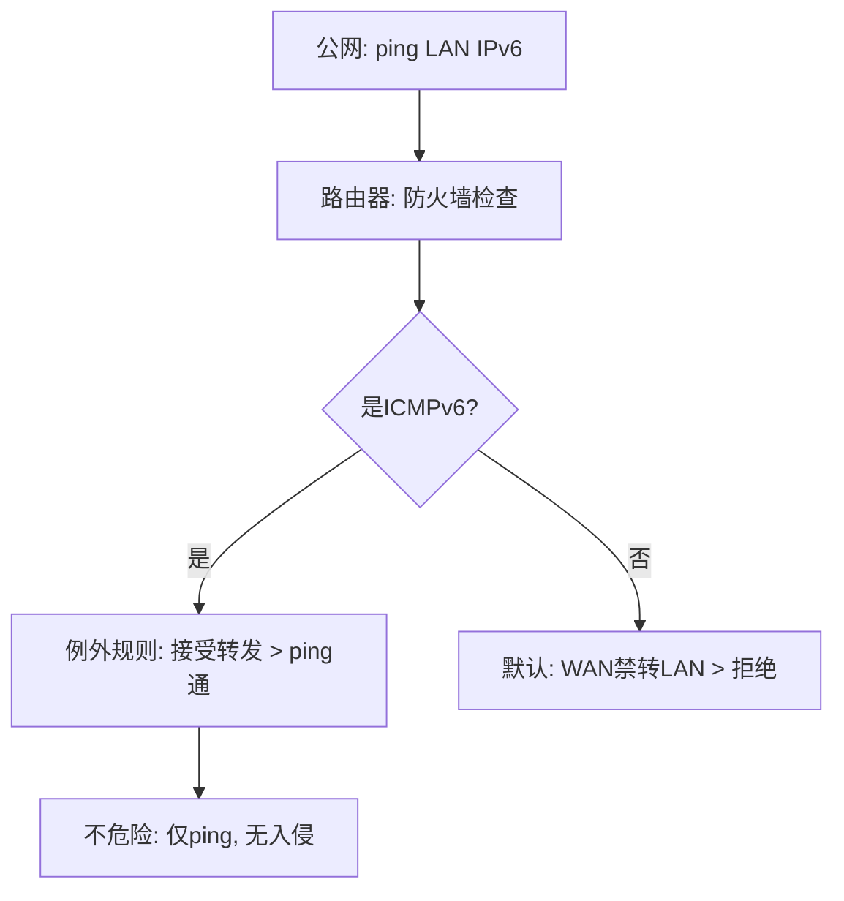
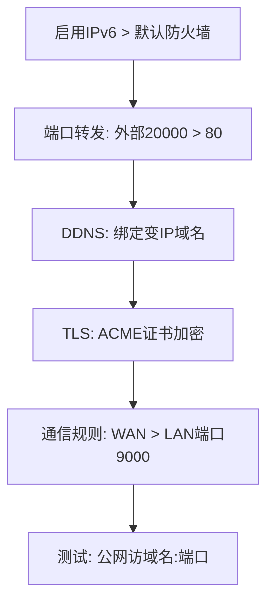

今天我们来聊聊家庭网络安全这个热门话题。如果你配置了IPv6后，发现公网能ping通内网设备，担心黑客入侵“屙屎屙尿”；或想安全地远程访问路由器、NAS家庭影音，甚至搭建免流节点，却怕暴露风险，这篇教程将用教学风格一步步带你入门。我们将从为什么需要家庭网络安全入手，解释它是什么，最后教你如何配置OpenWRT防火墙（基于最新OpenWRT 24.10.4，2025年10月22日发布）， 结合HomeProxy v1.43（2025年7月15日发布） 和OpenClash v0.47.015（2025年10月7日发布） 实现公网访问。读完后，你能自信地守护家庭网络，避免“裸奔”。前提：已按前文配置IPv6（ImmortalWRT 23.05兼容最新）。走起！

## 为什么需要家庭网络安全？

先来聊聊为什么会有家庭网络安全配置需求。IPv6普及后，每台设备都有公网IP，乍看便利，但痛点凸显：

* **暴露风险**：公网能ping通内网设备（如电脑、NAS），用户担心黑客直接入侵，窃取数据或植入恶意软件。许多人因此禁用IPv6，错过公网访问便利。
* **远程访问难题**：想异地管理路由器、访问NAS影音或搭建免流节点？传统IPv4公网稀缺，内网穿透（FRP等）贵、慢、不稳。IPv6免费跑满上行，但配置不当易泄露端口，黑客扫描入侵。
* **安全误区**：默认防火墙虽强，但端口转发、DDNS暴露服务时，易忽略TLS加密，遭中间人攻击；免流节点无密码，家被“偷”；多服务暴露，0day漏洞风险高。
* **代理冲突**：科学上网插件（如HomeProxy/OpenClash）运行时，IPv6流量绕过易DNS污染/泄漏，影响跨境电商或隐私。

家庭网络安全的出现，就是为了解决这些：在公网IPv6时代，守护内网不裸奔，实现安全远程访问。尤其适合NAS用户、远程工作者和免流党。忽略安全？黑客随时来访；配置好？公网便利+零担忧。

痛点对比用Mermaid表格展示：

如图，安全配置化险为夷。

## 家庭网络安全是什么？

家庭网络安全不是抽象概念，而是通过防火墙、规则等守护内网免受公网威胁。核心是OpenWRT防火墙（nftables/iptables），默认设置已强悍。

* **防火墙作用**：路由器转发数据时，防火墙决定接受/拒绝。默认：LAN（内网）可出WAN（互联网），WAN禁入LAN；LAN入站接受（访问路由器），WAN入站拒绝。转发LAN内互访，禁WAN转LAN。
* **IPv6 ping通不危险**：公网ping通内网因ICMPv6例外规则（RA/ICMP必要），但仅限指定类型，非裸奔。默认防火墙禁WAN转LAN，黑客无法入侵。
* **区域与规则**：LAN（绿，内网设备）；WAN（红，互联网）。例外：通信规则放行ICMPv6，但不影响安全。端口转发（DNAT）允许特定访问，但需慎用。
* **扩展安全**：DDNS动态绑定变IP域名；TLS证书加密防劫持；免流节点需密码；多服务用VPN避暴露。

防火墙流程用Mermaid图展示（WAN ping LAN）：

如图，默认安全，ping通≠暴露。

## 该如何解决？

好了，实战时间！我们用OpenWRT配置防火墙（前提：IPv6启用，插件关闭）。目标：安全公网访问路由器/NAS、搭建节点。分步教你，结合HomeProxy/OpenClash。

### 1. 验证默认安全（不改防火墙）

* 网络 > 防火墙：LAN出WAN允许，WAN入LAN拒绝。通信规则：ICMPv6例外放ping，但禁入侵。
* 测试：公网ping LAN IPv6通，但TCP ping端口拒（e.g., 80）。禁用ICMP例外（慎！可能断网），ping不通。
* 建议：别删默认规则，易砖机。

### 2. 公网远程访问路由器

* 防火墙 > 端口转发 > 加：IPv6，TCP，外部20000 > 内部80（管理页）。保存应用。
* 测试：手机5G访http://[WAN IPv6]:20000，进入管理。
* 为什么通？端口转发DNAT例外放行。

### 3. DDNS动态域名（应对IPv6变前缀）

* 服务 > 动态DNS > 加：CF提供商，域名e.g., router.example.com，IPv6命令获取WAN前缀。填API Token/Zone ID。保存应用。
* 测试：域名解析变IP，随时访域名:20000。

### 4. TLS证书加密（防劫持）

* 系统 > 软件包 > 安装luci-app-acme/acme。
* 服务 > ACME > 加：域名router.example.com，DNS API CF，填Zone ID/Token。保存应用。
* uHTTPd > 证书路径 > /etc/acme/router.example.com/fullchain.pem，私钥key.pem。保存应用。
* 测试：https://router.example.com:20000，无警告。

### 5. 公网访问NAS/影音（LAN设备）

* 关设备防火墙，统一路由器管。
* 防火墙 > 通信规则 > 加：WAN > LAN，目标IPv6后64位（反掩码::[接口ID]/::ffff:ffff:ffff:ffff），端口9000，接受。
* DDNS：同上，加NAS域名，命令前缀br-lan+后64位。
* 测试：公网访[NAS IPv6]:9000或域名:9000，得NAS日志。

配置流程图：

### 6. 搭建免流节点（路由器上）

* HomeProxy > 服务器 > 加：VMess+WS，端口8899，UUID自定义。启用防火墙自动。保存应用。
* OpenClash：覆写 > 加认证，防火墙通信规则放行7893（TCP，仅socks/http，慎UDP）。
* 测试：公网代理工具连8899，全局上网（上行限速）。免流填host。

### 7. 高级：NAT分载/VPN

* 防火墙 > NAT分载：启用硬件/软件，提升性能，但慎（兼容OpenGFW等）。
* 多服务暴露？用VPN（WireGuard等）模拟内网连接，避公网暴露。下期详解。

恭喜！你现在是家庭网络安全高手。遇到问题？查防火墙日志，慎改默认
