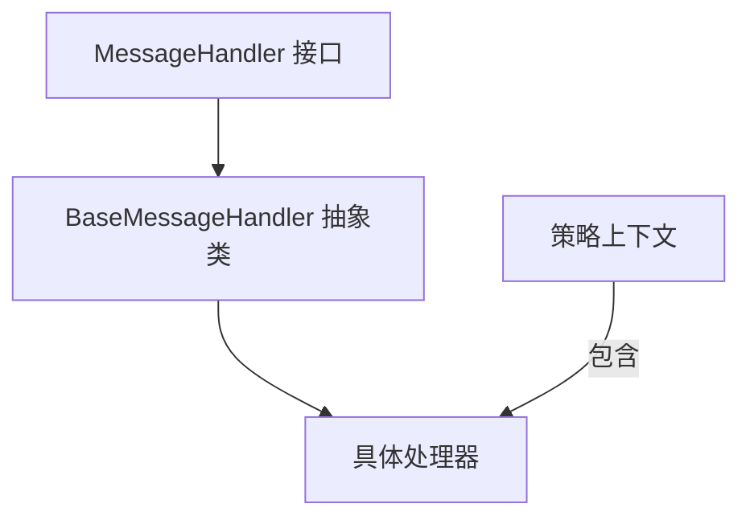
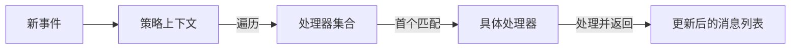

## 前言

最近开发AI对话功能时，遇到了对话显示的复杂需求。该场景需要处理AI返回的流式数据，涉及多种判断逻辑：数据是否属于新增对话、是否为增量更新、是否涉及工具调用等。若仅使用`if/else`模式，代码会迅速臃肿且逻辑难以维护。为此，我通过设计模式重构了代码结构，最终采用**策略模式**成功解耦了各类判断逻辑。

## 解决方案

策略模式作为行为型设计模式，其核心在于**定义算法族并封装每个算法，使其可相互替换**。这种设计让算法变化独立于客户端，完美匹配了需求场景。优势体现在：

1. **开闭原则**：新增处理器只需添加类，无需修改调度逻辑
2. **消除条件爆炸**：替代大型`switch/case`或`if/else`结构
3. **职责清晰**：每个处理器仅关注单一事件类型
4. **灵活扩展**：通过调整处理器数组顺序即可控制优先级

## 策略模式的类设计图

1. 分层结构



2. 执行流程



## 具体代码

这里我给出部分代码示例，只要对这个模式有了正确的理解，那么后续就是按需扩展处理器而已

```typescript
interface MessageHandler {
    canHandle(event: any, opts?: any, prevMessageList?: any[]): boolean;
    handle(event: any, prevMessageList: any[], opts?: any): any[];
  }
  
  abstract class BaseMessageHandler implements MessageHandler {
    abstract canHandle(event: any, opts: any, prevMessageList?: any[]): boolean;
    abstract handle(event: any, prevMessageList: any[], opts: any): any[];
  
    protected createMessage(content: string, role: RoleType, event: any, opts?: any) {
        const fileParseStatus = opts && opts.fileInfo ? event.data.type === "function_call" ? 1 : 
        event.data.type === "tool_response" ? 2 : undefined:undefined  
      return {
        content,
        role,
        fileInfo: (opts && opts.fileInfo) ?  opts.fileInfo : undefined,
        fileParseStatus: fileParseStatus,
        event
      };
    }
  }

  class BottomMessageEventHandle extends BaseMessageHandler{
    canHandle(_event: any, _opts: any, _prevMessageList?: any[]): boolean {
      // 想要那个策略被响应就这里的判断条件返回true
        return true
    }
    handle(_event: any, _prevMessageList: any[], _opts: any): any[] {
        return _prevMessageList
    }
  }

  export class MessageHandlerStrategy {
    private handlers: MessageHandler[];
  
    constructor() {
      this.handlers = [
        new BottomMessageEventHandle()
      ];
    }
  
    process(event: any, prevMessageList: any[], opts: any): any[] {
      for (const handler of this.handlers) {
        if (handler.canHandle(event, opts, prevMessageList)) {      
          return handler.handle(event, prevMessageList, opts);
        }
      }
      return prevMessageList; // 理论上不会执行到这里
    }
  }
```

由于我的代码是react，所以我导入到对应的react组件中

```typescript
export const XXXProvider{

const messageHandlerStrategy = useRef(new MessageHandlerStrategy());
.....
client.on((_eventName, event: any) => {
      // 交给状态机处理解析流程

      if (
        event.event_type !== ChatEventType.CONVERSATION_MESSAGE_DELTA &&
        event.event_type !== ChatEventType.CONVERSATION_MESSAGE_COMPLETED &&
        event.event_type !== "conversation.created"
      ) {
        return;
      }
  
      setMessageList(prev => 
        messageHandlerStrategy.current.process(event, prev, opts)
      );
})
.....
}
```

## 结语

采用策略模式虽然增加了代码结构复杂度，但显著提升了系统的灵活性和可维护性：

- 新增事件类型只需扩展处理器类
- 逻辑修改被隔离在独立处理器中
- 处理器优先级可动态调整
  该方案已在实际项目中验证了其有效性。如果您有更优的解决方案或改进建议，欢迎在评论区交流探讨！

