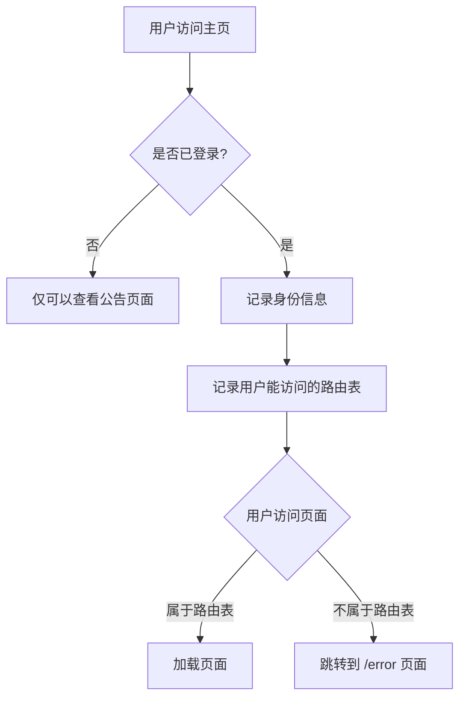

## 前言

这篇文章是写给刚入门 Vue 框架开发或者刚入门的同学，权限管理是基本上每一个项目都会遇到问题，你有登陆，有游客等身份，你总要不同的身份会有不同的网页访问吧。下面就实现从想法到权限管理的构建。

## 必备条件

1. Vue3 项目开发语言基础了解
2. Vue-router 路由管理基础了解
3. Pina 状态管理器基础了解
4. 首先执行创建工程语句
   
   ```bash
   pnpm create vite my-vue-app --template vue-ts
   ```

这样就得到了一个 vue3+vite 项目。

5. 安装路由、状态管理器以及持久化插件
   
   ```bash
   pnpm install vue-router@4 pinia pinia-plugin-persistedstate
   ```
   
   这个目的是存储我们的用户信息和当前的路由表

## 大致想法



这样的话就完成了用户的基础路由权限设计。

## 操作演示

实际的路由表的更新主要是通过 `addRoute` 和 `removeRoute` 来控制。

1. 在 `src/pages` 下面新建 `admin.vuecustom.vue``error.vuehome.vue``user.vue` 。分别写入页面名称就行。例如 `amdin.vue` 页面内容。
   
   ```html
   <template>
     <div>我是admin页面</div>
   </template>
   
   <script setup lang="ts"></script>
   <style scoped lang="scss"></style>
   ```
2. 在 `src/store` 中新建 `permission.ts` 写入下面的内容
   
   ```tsx
   import { defineStore } from "pinia";
   import { publicRoutes, privateRoutes } from "../router";
   import { RouteRecordRaw } from "vue-router";
   
   export const useRoutesStore = defineStore("routes", {
     state: () => ({
       routes: publicRoutes,
     }),
   
     actions: {
       setRoutes(newRoutes: RouteRecordRaw[]) {
         this.routes = [...publicRoutes, ...newRoutes];
       },
       filterRoutes(role: string) {
         this.routes = [
           ...publicRoutes,
           ...privateRoutes.filter((item) => item.meta.role === role),
         ];
         return this.routes;
       },
     },
     persist: {
       storage: localStorage,
     },
   });
   ```
   
   在 `src/store` 中新建 `user.ts` 写入下面的内容
   
   ```tsx
   import { defineStore } from "pinia";
   
   export type Role = "admin" | "custom" | "user";
   
   export const useUserRoleStore = defineStore("userInfo", {
     state: (): { role: Role } => ({
       role: "user",
     }),
     getters: {
       getRole: (state) => state.role,
     },
     actions: {
       changeRole(role: Role) {
         this.role = role;
       },
     },
     persist: {
       storage: window.localStorage,
     },
   });
   ```
3. 可以对路由文件进行划分，这样会显得目录清晰。例如我建立了 `admincustom``user`。三个私有路由的文件，然后导入了一个文件中再合并成一个私有路由参数。当然你可以分的更细致，我这里只做个 demo
   例如 `src/router/admin.ts` 内容如下
   
   ```tsx
   const Admin = () => import("../pages/admin.vue");
   export const adminRoutes = [
     {
       name: "admin",
       component: Admin,
       children: [],
       path: "/admin",
       meta: { role: "admin" },
     },
   ];
   ```
4. 在路由总文件处注册路由 `src/router/index.ts` 。
   这个文件大致要做 4 件事，当然你也可以细致的分划一下。
   
   1. 导入私有路由的组合和公共路由
   2. 使用 `createRouter` 创建路由
   3. 编写全局路由功能:跳转前，看是路由是否存在
   4. 抛出修改路由表的方法
   
   那么他的具体内容如下
   
   ```tsx
   import {
     createWebHashHistory,
     createRouter,
     RouteRecordRaw,
   } from "vue-router";
   import { useUserRoleStore } from "../store/user";
   
   import { userRoutes } from "./user";
   import { adminRoutes } from "./admin";
   import { customRoutes } from "./custom";
   import { useRoutesStore } from "../store/permission";
   
   // 导出所有的私密路由
   export const privateRoutes = userRoutes
     .concat(adminRoutes)
     .concat(customRoutes);
   
   const Home = () => import("../pages/home.vue");
   const Error = () => import("../pages/error.vue");
   
   export const publicRoutes: RouteRecordRaw[] = [
     { name: "home", component: Home, children: [], path: "/" },
     { name: "error", component: Error, children: [], path: "/error" },
   ];
   
   export const router = createRouter({
     history: createWebHashHistory(),
     routes: publicRoutes,
   });
   
   //TODO 全局路由，跳转前，看是路由是否存在
   // 假设用户时已经登陆的，这里只是做路由的动态修改操作
   router.beforeEach(async (to, from, next) => {
     const userRoleStore = useUserRoleStore();
     const routeStore = useRoutesStore();
     const filterRoutes = routeStore.filterRoutes(userRoleStore.role);
     filterRoutes.forEach((item) => {
       router.addRoute(item);
     });
     const exist = router.getRoutes().some((route) => route.path === to.path);
     console.log("跳转前", router.getRoutes(), to.path, exist);
     if (exist) {
       next();
     } else {
       next(false);
       router.push("/error");
     }
   });
   
   //TODO 抛出添加路由的方法
   
   export const filterRoleRoutes = async () => {
     const userRoleStore = useUserRoleStore();
   
     let preRoutes = router.getRoutes();
     preRoutes.forEach((route) => {
       if (
         route.meta.role &&
         route.meta.role !== userRoleStore.role &&
         route.name
       ) {
         router.removeRoute(route.name.toString());
       }
     });
   };
   ```
   
   > 如果仅仅只是上面的操作的话，那么会出现用户切换了身份，路由更新了，但是点击对应的页面，他没法跳转。以及刷新的时候，路由表还没更新到当前用户的路由表，会无法访问具体的私有路由页面。
5. 这里就是通过 App.vue 里的逻辑来改造上面描述的问题。当然里面的函数和方法你也可以封装和优化。
   
   ```tsx
   <template>
     <div>
       <span>切换身份:</span>
       <button @click="changeRoleFn('user')">user</button>
       <button @click="changeRoleFn('custom')">custom</button>
       <button @click="changeRoleFn('admin')">admin</button>
     </div>
     <div>
       <span>跳转路由</span>
       <button
         @click="
           () => {
             router.push('/user');
           }
         ">
         user
       </button>
       <button
         @click="
           () => {
             router.push('/custom');
           }
         ">
         custom
       </button>
       <button
         @click="
           () => {
             router.push('/admin');
           }
         ">
         admin
       </button>
     </div>
     <div>
       <RouterView></RouterView>
     </div>
   </template>
   
   <script setup lang="ts">
   import { filterRoleRoutes } from "./router";
   import { Role, useUserRoleStore } from "./store/user";
   import { useRouter } from "vue-router";
   import { useRoutesStore } from "./store/permission";
   
   const userRoleStore = useUserRoleStore();
   const router = useRouter();
   const routeStore = useRoutesStore();
   
   const changeRoleFn = async (role: Role) => {
     userRoleStore.changeRole(role);
   
     // 内存添加路由表
     const filterRoutes = routeStore.filterRoutes(userRoleStore.role);
     filterRoutes.forEach((item) => {
       router.addRoute(item);
     });
     // 路由更新，删除不符合当前身份的路由
     filterRoleRoutes();
     routeStore.filterRoutes(role);
   };
   
   // TODO每次刷新的时候检查下更新路由表
   const filterRoutes = routeStore.filterRoutes(userRoleStore.role);
   filterRoutes.forEach((item) => {
     router.addRoute(item);
   });
   
   // TODO 这里如果不手动更新跳转的话，route.path的值实际上是'/' 而不是你浏览器上显示的网络地址
   router.push(location.hash.replace(/#/, ""));
   </script>
   
   <style scoped></style>
   ```
   
   代码上有详细的解释。其实原理很简单，主要是踩的坑会比较麻烦。

## 功能权限控制

上面一块是大的页面权限的控制，那么同一个身份下的用户，有不同的功能。对于功能也是需要区分开的。

### 想法

通过指令来决定当前的这个 dom 是不是要渲染，如果身份不对就不渲染。不渲染你想点击也没法点。

那么下面就简单的给出部分代码

新建一个指令文件夹，编写 `permission`指令代码

```tsx
import { useUserRoleStore } from "../store/user";

function checkPermission(el: any, binding: any) {
  const userRoleStore = useUserRoleStore();
  // 获取绑定的值，此处为权限
  const { value } = binding;
  const userName = userRoleStore.name;

  // 当传入的指令集为数组时
  if (value && value instanceof Array) {
    // 匹配对应的指令
    const hasPermission = value.includes(userName);
    // 如果无法匹配，则表示当前用户无该指令，那么删除对应的功能按钮
    if (!hasPermission) {
      el.parentNode && el.parentNode.removeChild(el);
    }
  } else {
    // eslint-disabled-next-line
    throw new Error('v-permission value is ["admin","editor"]');
  }
}

export default {
  // 在绑定元素的父组件被挂载后调用
  mounted(el: any, binding: any) {
    checkPermission(el, binding);
  },
  // 在包含组件的 VNode 及其子组件的 VNode 更新后调用
  update(el: any, binding: any) {
    checkPermission(el, binding);
  },
};
```

后面就是注册到 app 上。当然了最好是弄一个单独的文件，然后统一的注册。单独注册的语法如下 `app.directive("permission", permission);` 我这里就省略了，具体可以看源码

那么使用的话就只需像如下的 `admin.vue`页面一样

```tsx
<template>
  <div>我是admin页面</div>
  <!-- 因为我在useStore里面写死了name为david，所以效果就是只有david这个按钮显示 -->
  <button v-permission="['david']">david可以点</button>
  <button v-permission="['lisa']">lisa可以点</button>
</template>

<script setup lang="ts"></script>
<style scoped lang="scss"></style>
```

## 源码以及效果

效果就是，你切换对应的身份，那么他身份下的路由页面，你可以访问，相反的不是他的路由页面，你只能访问到 `/error` 页面。

> 当然你可以不用动态路由的方法来实现，你也可以仅仅通过全局理由 `beforeEach` 来判断当前要去的页面是否能被访问

[https://github.com/HideInMatrix/vue3-router-permission](https://github.com/HideInMatrix/vue3-router-permission)


