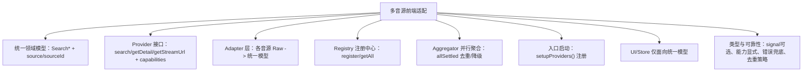

适配这事，说难不难，说简单也不简单。难在“不同音源长得都不一样”，简单在“把不一样的地方包起来，剩下的都一样”。这篇从开发者视角拆解我在项目里做的多音源适配改造，目标是：后端新增一个音源，前端只需要加一个 Provider+Adapter，然后在注册中心点一下，不动页面、不动 Store、不动播放器。

### 我们到底要解决什么问题

- 各音源返回结构五花八门，字段名、缺省项都不一致。
- 搜索、详情、播放链路每家规则都不同。
- 你要是直接在页面里 if/else 分支判断音源，很快失控。

核心策略：前端定义“统一领域模型”，上层（UI/Store/Player）只看统一模型；音源差异通过 Provider+Adapter 收敛在底层，新增音源→新增一个 Provider 实现即可。

---

## 总览图



---

## 统一领域模型：只面向 Search*

由于项目里已经有一套统一模型：`SearchSongProps/SearchAlbumsProps/SearchArtistProps/SearchPlaylistProps`。所以我这里额外补三个可选字段：

- `source`: 来自哪个音源（比如 `ytmusic/jiosaavn`）
- `sourceId`: 音源内的原始 ID（后续详情/跳转非常有用）
- `raw`: 可选，保留原始数据方便调试（不强依赖）

这样 UI 只认这套模型，不管底层是 YouTube Music 还是 JioSaavn。

---

## Provider 接口：所有音源统一的能力面

给每个音源定一套统一签名，不要让页面和 Store 认识到“谁是谁”。只要是 Provider，都要遵守这份接口：

```15:29:src/apis/core/types.ts
export interface SourceProvider {
  id: MusicSource
  displayName: string
  capabilities: SourceCapabilities

  searchSongs?(keyword: string, options?: { signal?: AbortSignal }): Promise<SearchSongProps[]>
  searchAlbums?(keyword: string, options?: { signal?: AbortSignal }): Promise<SearchAlbumsProps[]>
  searchArtists?(keyword: string, options?: { signal?: AbortSignal }): Promise<SearchArtistProps[]>
  searchPlaylists?(keyword: string, options?: { signal?: AbortSignal }): Promise<SearchPlaylistProps[]>

  getAlbumDetail?(albumId: string, options?: { signal?: AbortSignal }): Promise<{ albumInfo: SearchAlbumsProps; songs: SearchSongProps[] }>
  getPlaylistDetail?(playlistId: string, options?: { signal?: AbortSignal }): Promise<SearchSongProps[]>

  getStreamUrl?(songId: string, options?: { signal?: AbortSignal }): Promise<string>
}
```

注意点：

- 参数签名扁平化：`(keyword, options?)`，不要再传“大对象包参数”那种。
- `options.signal` 统一是可选的（`signal?: AbortSignal`），这样顶层不传也不会报类型错。
- `capabilities` 显式声明支持的功能，UI 可以按能力显隐，不用写一堆 if。

---

## Adapter：把 Raw 长相变成统一模型

每个音源都有它自己的 Raw 结构，适配的第一步就是“翻译”。例如 `YTMusic` 的 Adapter：

```12:77:src/lib/adapter/ytmusic.ts
export const adaptYTMusicSong = (song: SongData): SearchSongProps => {
  return {
    id: song.videoId,
    name: song.name,
    artists: [{
      id: song.artist.artistId || '',
      name: song.artist.name,
      image: song.thumbnails.map(t => t.url)
    }],
    duration: song.duration,
    album: {
      id: song.album.albumId,
      name: song.album.name
    },
    url: `https://music.youtube.com/watch?v=${song.videoId}`,
    image: song.thumbnails[0]?.url || ''
  };
};
```

`JioSaavn` 也抽 Adapter，不把映射写死在请求函数里。Adapter 只做映射，不做网络。

---

## 注册中心与聚合器：统一管理、并行检索

- 注册中心负责把 Provider 注册起来，便于动态开关、按用户设置选择源。
- 聚合器负责并行请求多个 Provider，然后合并、去重、降级（谁挂了就忽略谁）。

聚合器示意：

```4:13:src/apis/core/aggregate.ts
export async function aggregateSearchSongs(keyword: string, opts?: { sources?: SourceProvider[], signal?: AbortSignal }) {
  const sources = opts?.sources || getAllProviders().filter(p => p.capabilities.searchSong && p.searchSongs)
  const settled = await Promise.allSettled(
    sources.map(p => p.searchSongs!(keyword, { signal: opts?.signal }).then(list =>
      list.map(item => ({ ...item, source: p.id, sourceId: item.sourceId || item.id }))
    ))
  )
  const results = settled.flatMap(s => s.status === "fulfilled" ? s.value : [])
  return results
}
```

要点：

- 用 `Promise.allSettled` 做“软并行”，有源失败不拖累整体。
- 合并时把 `source/sourceId` 补齐，后续可用来跳详情页或取直链。
- 去重策略可以先用 `name + artists`，再慢慢进化成相似度算法。

---

## Provider 实现：把老 API 包成新签名

以 `JioSaavn` 为例，原来我们有一堆 `fetchXxx({ value, options, page, limit }) -> { data, total }`。Provider 需要的签名是 `(keyword, options?) -> Search*[]`。做法很简单——包一层：

- 在 `src/apis/jio-savvn/index.ts` 里新增：

  - `searchSongs/searchAlbums/searchArtists/searchPlaylists`
  - `getAlbumDetail`: 用 `fetchSongsByAlbumId` 补一个 `albumInfo`
  - `getPlaylistDetail`: 用 `fetchSongsByPlaylistId` 直接取 `data`
- 把 `options` 类型放宽为 `{ signal?: AbortSignal }`，不再要求必传 `signal`。
- 在 `provider.ts` 里挂到 Provider：

```5:18:src/apis/jio-savvn/provider.ts
export const jioSavvnProvider:SourceProvider = {
    id: MusicSource.JioSaavn,
    displayName: "JioSaavn",
    capabilities: {
        searchSong: true, searchAlbum: true, searchArtist: true, searchPlaylist: true,
        getAlbumDetail: true, getPlaylistDetail: true, getStreamUrl: false
      },
      searchSongs: api.searchSongs,
      searchAlbums: api.searchAlbums,
      searchArtists: api.searchArtists,
      searchPlaylists: api.searchPlaylists,
      getAlbumDetail: api.getAlbumDetail,
      getPlaylistDetail: api.getPlaylistDetail,
}
```

最后在启动时注册：

```ts
// src/apis/core/bootstrap.ts
registerProvider(ytmusicProvider)
registerProvider(jioSavvnProvider)
```

---

## UI/Store 怎么用

- 搜索页：要多源就用聚合器；要某个指定源就取注册中心的 Provider 调一次。
- 专辑/歌单详情：从 item 的 `source` 定位到 Provider，再调 `getAlbumDetail/getPlaylistDetail`。
- 播放器：如果某些源需要单独换直链，就在 Provider 里实现 `getStreamUrl`，播放器只管拿 URL。

---

## 实战踩坑与经验

- 类型统一非常关键。Provider 签名统一后，页面几乎不需要再处理“对象包参数 vs 扁平参数”的差异。记得让 `signal` 可选。
- 能力显式能极大减少分支判断。比如某源不支持某功能（歌单详情），UI 可以很自然地隐藏入口。
- 去重与排序不要一开始就太复杂，先做“能用”，再慢慢优化体验。
- 错误兜底应该做到“静默稳定”：谁失败就忽略谁，不要让一个源的波动影响整体。
- 如果你能动后端，强烈建议后端直接输出统一模型并带 `source/sourceId`，前端 Adapter 减负一半。

---

## 新音源接入 Checklist

- 定义 Raw 类型（可选，但强烈建议）
- 写 Adapter：Raw → `Search*`
- 写 API 包装：按 Provider 签名导出 `search* / get*`
- 写 Provider 实现：把这些方法挂上去
- 在 `setupProviders()` 里注册
- 可选：设置页给这个音源加一个开关

---

## 结语

“把差异关到一间屋子里”，上层只认统一模型，这就是适配层的意义。做对了这一步，以后加新音源就是家常便饭：新增 Provider + 注册，一下午搞定。开发效率稳了，体验也稳了。
