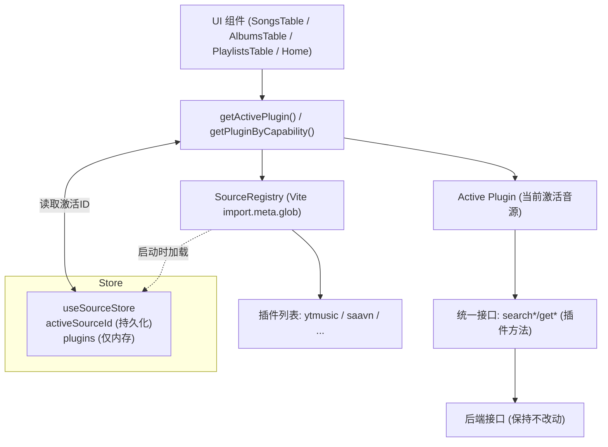

做 free-music 的时候，我遇到了一个典型需求：后端会不断接入新的音源，我不想每次都去大改前端代码。更不希望页面组件里堆满 `if (source === 'xxx')` 这种硬编码。于是我干脆把“音源”在前端抽象成“插件”，通过 Vite 扫描注册，统一接口，随时可插可换，页面层完全无需关心具体来源。

上图是我给自己画的结构脑图（运行时关系与数据流）：

- 插件由 Vite 在构建时扫描并懒加载；
- 在启动时加载到 store 的内存里；
- 只持久化当前激活的插件 ID；
- 页面通过统一接口从“当前插件”拿数据；
- 后端接口保持不变，插件适配不同音源。



### 目标与约束

- 只改前端，不动后端接口协议。
- 新音源接入只需新增一个插件文件夹，不改页面。
- 页面组件只依赖“统一数据模型”，不依赖具体音源 API。

### 总体方案（二话不说，先讲清楚）

- 标准化前端数据模型（Song/Album/Artist/Playlist）。
- 定义“音源插件接口” MusicSourcePlugin：统一方法签名。
- 约定插件目录 `src/plugins/{provider}/index.ts` 默认导出插件对象。
- Vite 用 `import.meta.glob` 扫描插件，启动时加载并写到 store。
- store 只持久化 `activeSourceId`（当前激活音源），不持久化插件本体。
- 页面和 hooks 一律通过 `getActivePlugin()` 或 `getPluginByCapability()` 调用方法。

### 插件接口：我约定的“能力清单”

我给插件定义了一个简单、稳定的接口规范。插件只要实现以下方法之一或多个即可。

```ts
// src/entity/interface/source.ts
export type SourceCapability =
  | "searchSongs" | "searchAlbums" | "searchArtists" | "searchPlaylists"
  | "getAlbumSongs" | "getPlaylistSongs" | "getArtistDetail" | "getSongById"
  | "getHomeRecommend" | "getStream";

export interface MusicSourceManifest {
  id: string;
  name: string;
  version: string;      // 插件作者自己标注；方便诊断与展示
  capabilities: SourceCapability[];
  priority?: number;    // 多音源合并时的优先级
}

export interface MusicSourcePlugin {
  manifest: MusicSourceManifest;
  // 以下方法任选其一或多个实现
  searchSongs?(keyword: string, options?: { signal?: AbortSignal }): Promise<{ data: SearchSongProps[]; total: number }>;
  searchAlbums?(keyword: string, options?: { signal?: AbortSignal }): Promise<{ data: SearchAlbumsProps[]; total: number }>;
  searchArtists?(keyword: string, options?: { signal?: AbortSignal }): Promise<{ data: SearchArtistProps[]; total: number }>;
  searchPlaylists?(keyword: string, options?: { signal?: AbortSignal }): Promise<{ data: SearchPlaylistProps[]; total: number }>;
  getAlbumSongs?(albumId: string, options?: { signal?: AbortSignal }): Promise<{ data: SearchSongProps[]; total: number }>;
  getPlaylistSongs?(playlistId: string, options?: { signal?: AbortSignal; page?: number; limit?: number }): Promise<{ data: SearchSongProps[]; total: number }>;
  getArtistDetail?(artistId: string, options?: { signal?: AbortSignal; page?: number }): Promise<{ id: string; name: string; image: string; topSongs: SearchSongProps[] } | null>;
  getSongById?(id: string, options?: { signal?: AbortSignal }): Promise<{ data: SearchSongProps[] } | null>;
  getHomeRecommend?(options?: { signal?: AbortSignal }): Promise<any>;
  getStream?(songId: string): Promise<{ url: string }>;
}
```

我要求每个插件暴露 `manifest`，其中 `id/name/version/capabilities/priority` 都是纯数据，方便 UI 显示、调试与聚合策略。`version` 来自插件作者在文件里写死的字段，不是 Zustand persist 的版本号。

### Vite 扫描注册：插件如何被“发现”与“加载”

我用 Vite 的 `import.meta.glob` 做目录扫描，启动时统一加载：

```ts
// src/lib/sourceRegistry.ts
const pluginModules = import.meta.glob("../plugins/*/index.ts", { import: "default" });

export async function loadAllPlugins(): Promise<MusicSourcePlugin[]> {
  const loaded: MusicSourcePlugin[] = [];
  for (const importer of Object.values(pluginModules)) {
    const mod = await importer() as MusicSourcePlugin;
    if (mod?.manifest?.id) {
      loaded.push(mod);
    }
  }
  return loaded.sort((a, b) => (b.manifest.priority ?? 0) - (a.manifest.priority ?? 0));
}
```

应用启动时，我异步加载插件并注册到 store：

```ts
// src/main.tsx
(async () => {
  try {
    const plugins = await loadAllPlugins();
    useSourceStore.getState().setPlugins(plugins);
  } catch (e) {
    console.error("Failed to load plugins", e);
  }
})();
```

### 为什么“插件”需要放在 store 里（而且不持久化）

- 全局访问：页面与 hooks 在任何地方都能通过 `getActivePlugin()` 拿当前插件。
- 响应式更新：用户切换音源，组件无需重写，只依赖 store 的当前选择。
- 避免重复扫描：只在启动时扫描一次，再放内存即可。
- 不持久化 `plugins`：插件是运行时对象（含函数），不适合 JSON 序列化。只持久化 `activeSourceId` 即可。

store 的定义如下：

```ts
// src/store/useSourceStore.ts
export const useSourceStore = create<SourceStore>()(
  persist(
    (set, get) => ({
      plugins: [],
      activeSourceId: null,
      setPlugins: (plugins) => {
        const currentActive = get().activeSourceId;
        const exists = plugins.some((p) => p.manifest.id === currentActive);
        set({ plugins, activeSourceId: exists ? currentActive : plugins[0]?.manifest.id ?? null });
      },
      setActiveSourceId: (id) => set({ activeSourceId: id }),
    }),
    {
      name: "music-sources",
      storage: createJSONStorage(() => localStorage),
      partialize: (state) => ({ activeSourceId: state.activeSourceId }), // 只存当前选中的音源
    }
  )
);

export function getActivePlugin(): MusicSourcePlugin | null {
  const { plugins, activeSourceId } = useSourceStore.getState();
  return plugins.find((p) => p.manifest.id === activeSourceId) ?? null;
}
```

这也解释了为什么 localStorage 里只有：

```json
{
  "state": { "activeSourceId": "ytmusic" },
  "version": 0
}
```

- 这是对的：我们只持久化 `activeSourceId`；
- 这个 `version: 0` 是 Zustand persist 的内部版本号；
- 插件 `manifest.version` 是我在插件文件里写的，不会出现在 localStorage。

### 我怎么把现有两个音源包成插件

- YTMusic 插件（适配现有 `@/apis/ytmusic/ytmusic`）

```ts
// src/plugins/ytmusic/index.ts
const plugin: MusicSourcePlugin = {
  manifest: {
    id: "ytmusic",
    name: "YouTube Music",
    version: "1.0.0",
    capabilities: ["searchSongs","searchAlbums","searchArtists","searchPlaylists","getHomeRecommend","getAlbumSongs","getPlaylistSongs"],
    priority: 90,
  },
  async searchSongs(keyword, options) {
    const data = await searchSongs(keyword, { signal: options?.signal as AbortSignal });
    return { data, total: data.length };
  },
  // 其他方法省略，思路一致
};
export default plugin;
```

- Saavn 插件（适配现有 `@/apis/jio-savvn/index`）

```ts
// src/plugins/saavn/index.ts
const plugin: MusicSourcePlugin = {
  manifest: {
    id: "saavn",
    name: "JioSaavn",
    version: "1.0.0",
    capabilities: ["searchSongs","searchAlbums","searchArtists","searchPlaylists","getAlbumSongs","getPlaylistSongs","getArtistDetail","getSongById"],
    priority: 80,
  },
  async searchSongs(keyword, options) {
    const { data, total } = await fetchSongs({ value: keyword, options: { signal: options?.signal as AbortSignal }, page: 0, limit: 20 });
    return { data, total };
  },
  // 其他方法同理
};
export default plugin;
```

### 页面与 hooks 如何无感切换

我把调用点都换成了“找插件再调用”的方式，页面不关心具体音源：

- 搜索 hooks：`src/hooks/search.tsx` 和 `src/hooks/fetchSongsByYtmusic.tsx` 统一改为：

```ts
const plugin = getActivePlugin();
const res = await plugin?.searchSongs?.(keyword, { signal }); // 能力存在才调用
```

- 艺术家详情页：`src/app/(detail)/artists/[id]/page.tsx` 调用：

```ts
const plugin = getActivePlugin();
plugin?.getArtistDetail?.(artistsId, { signal }).then(setArtistsInfo);
```

组件层不再 import 某个具体 API，只拿“激活插件”的方法即可。

### 我是如何组织开发流程的

1) 先把“统一数据模型”和“插件接口”定清楚（这是系统稳定的关键）。
2) 实现 `sourceRegistry` + `useSourceStore`，保证插件加载与选择的基础设施可用。
3) 给现有的两个音源各写一个插件包装器，保证等价功能迁移。
4) 把 hooks 和页面改为“从插件拿数据”。
5) 本地跑通并检查（Zustand 持久化只看到 `activeSourceId` 是正常现象）。

### 可选的“再进化”

- 多音源聚合：同一个搜索并行请求多个插件，根据 `priority` 和去重规则融合结果。
- UI 增强：提供设置面板，列出插件清单（用 `manifest`，不是把插件对象持久化），让用户选择默认音源。
- 动态远程插件（高级玩法）：白名单域名 + SRI 校验，远程加载 UMD/IIFE 插件并注册，必要时 iframe sandbox + postMessage。

### 踩坑与经验

- 不要把插件对象持久化：函数不可序列化，升级后老缓存可能“毒化”运行时。
- hooks 统一走 `getActivePlugin()`：避免在组件里四处 import 各种 API。
- `version` 两个概念不要混淆：Zustand 的持久化版本号不是插件 `manifest.version`。
- Vite 的 `import.meta.glob` 非常适合这种“前端插件发现”。

### 收尾

这套方案的核心价值：后端可以自由扩展音源；前端“以插件的方式”承载音源适配；页面逻辑稳定，开发体验流畅。新增音源时，我只要：

- 新建 `src/plugins/new-source/index.ts`；
- 实现少量方法；
- 启动后自动被扫描、注册、可选择、可调用。

代码已经落地在项目里。接下来我会补一个“设置页”让你切换音源、查看 `manifest` 信息，以及一个“聚合搜索”的可选开关。如果你有新的音源，我可以很快帮你接入。
