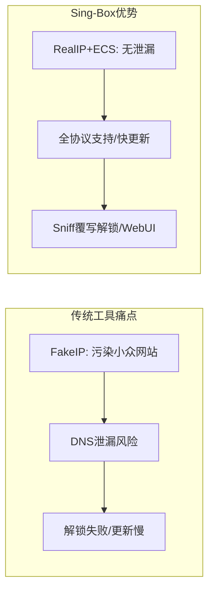
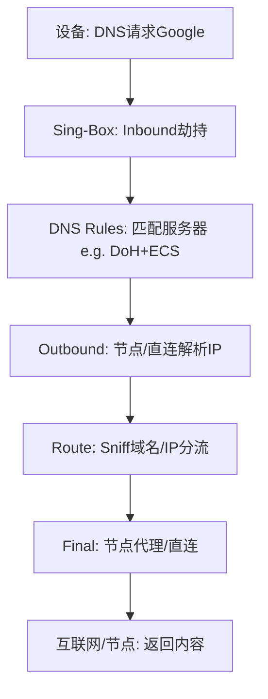
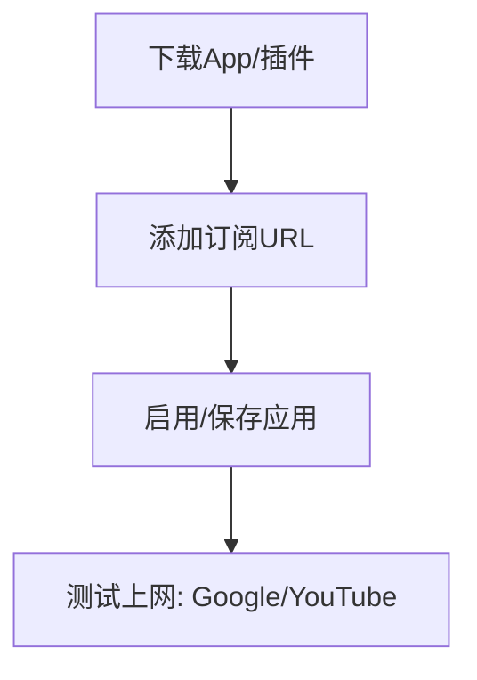
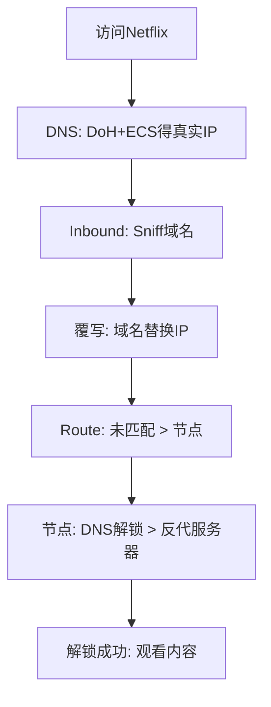

今天我们来聊聊Sing-Box这个“瑞士军刀”级的代理工具。如果你是个网络小白或软路由爱好者，纠结于DNS泄漏、污染、奈飞解锁失败等问题，这篇教程将用教学风格一步步带你入门。我们将从为什么需要Sing-Box入手，解释它是什么，最后教你如何配置实现无泄漏、低延迟的科学上网。读完后，你能自信地抛弃FakeIP，拥抱RealIP，从此告别DNS烦恼。注意，本教程基于Sing-Box v1.11.0（2025年1月最新版，支持更多协议优化）。 走起！

## 为什么需要Sing-Box？

先来聊聊为什么会有Sing-Box。传统代理工具如V2Ray或Clash虽好，但痛点不少：

* **DNS泄漏与污染**：FakeIP模式易导致小众国内网站走代理，访问慢；DNS请求暴露给运营商，隐私风险高。RealIP虽真实，但配置不当易污染（国内流量走海外）。
* **协议支持与兼容**：V2Ray服务器端强但客户端弱；Clash客户端友好但更新慢，新协议（如Hysteria2）支持滞后。软路由上，插件如OpenClash功能多但配置复杂，易漏UDP流量。
* **解锁与性能**：奈飞/ChatGPT解锁需DNStrick，QUIC/HTTP3处理不当失败；多设备（手机/电脑/路由）配置不统一，软路由无WebUI切换节点麻烦。
* **扩展性**：机场订阅转换隐私风险高；FakeIP游戏连接问题多；RealIP需优雅分流，避免死循环。

Sing-Box的出现，就是为了解决这些：它支持所有主流协议（SS、VMess、TUIC等），更新狂魔（几乎实时跟进新协议），兼容Clash API（WebUI切换节点）。用RealIP+ECS，彻底消除DNS泄漏/污染；Sniff嗅探+覆写解锁奈飞；HomeProxy插件让软路由配置so easy。结果？全平台统一，低延迟、无污染上网，尤其适合隐私党、流媒体爱好者和软路由用户。

痛点对比用Mermaid表格展示：

如图，Sing-Box像瑞士军刀，多功能解决网络难题。

## Sing-Box是什么？

Sing-Box是开源的通用代理平台，客户端/服务器端一体，支持几乎所有协议（Shadowsocks、Trojan、Hysteria、TUIC等）。它不像V2Ray重服务器、Clash重客户端，而是“全能王”：配置JSON灵活，更新频率高（官网GitHub常年活跃）。核心功能：

* **RealIP vs. FakeIP**：放弃FakeIP（虚拟IP防泄漏，但游戏/链式代理不便），拥抱RealIP（真实解析+缓存，结合ECS精确分流，避免污染）。
* **DNS模块**：Servers（上游DNS如DoH/DoT）和Rules（规则匹配），防泄漏/污染。ECS（Extended Client Subnet）让海外DNS返回本地IP，优雅分流小众网站。
* **Inbound/Outbound**：入站（劫持流量，如Redirect/TProxy/TUN）和出站（节点、直连）。Sniff嗅探（流量类型/域名检测）和覆写（替换目标IP为域名，助解锁）。
* **Route模块**：规则匹配（域名/IP/Clash模式），默认Final兜底。兼容Clash API，WebUI管理。
* **HomeProxy插件**：OpenWRT专用，LuCI界面简化配置，支持规则集（GeoIP/GeoSite二进制，省空间）。

平台支持：Android/iOS/Mac/Windows（第三方如v2rayN）；软路由用HomeProxy。官网文档详尽，但JSON配置需理解流程。

代理流程用Mermaid图展示（简化RealIP访问Google）：

如图，Sing-Box结构清晰，模块化处理流量。

## 该如何解决？

实战时间！我们分小白配置（跟操作）和进阶配置（懂原理）。前提：机场订阅支持Sing-Box（或转换工具）。软路由用ImmortalWRT 23.05+HomeProxy（Sing-Box内核1.9+）。

### 小白配置：手机/电脑/软路由快速上手

1. **手机（Android/iOS）**：App Store/Google Play下载Sing-Box（非国区ID）。Profiles > 新建远程 > 贴机场订阅URL > 创建。主界面启用，切换节点。访Google测试。
2. **电脑（Mac/Windows）**：Mac用官方App，同上。Windows用v2rayN支持Sing-Box，导入订阅启用。
3. **软路由（HomeProxy）**：LuCI > 软件包 > 更新 > 安装luci-i18n-homeproxy-zh-cn。节点设置 > 订阅 > 加机场URL > 更新。客户端设置 > 主节点选 > 路由模式（大陆白名单） > 保存应用。访Google测试。

小白流程图：

这样，无泄漏上网就成了！奈飞解锁需机场支持。

### 进阶配置：自定义RealIP+ECS+Sniff

为隐私/解锁优化，用HomeProxy自定义（或JSON手动）。目标：无污染分流、奈飞解锁、Clash WebUI。

1. **导入节点**：订阅加机场URL，更新列表。
2. **分组**：节点设置 > 加URLTest（自动选择，选节点） > 加Selector（手动选择，含自动） > 加GLOBAL Selector（全局，含以上，默认手动）。
3. **客户端**：自定义路由 > 代理模式（Redirect/TProxy/TUN/Mixed，按需） > 关IPv6 > 覆盖目标地址（Sniff覆写，助解锁） > 默认出站（手动） > 启用Clash API（IP:路由器IP，端口9090，节点自动）。
4. **DNS**：加DoH（Google，地址解析器WAN，仅IPv4，ECS:1.0.1.0中国IP）。默认策略IPv4，默认服务器Google。规则：节点域名默认DNS；Clash Direct默认；Clash Global Google；中国网站默认。
5. **路由**：规则集加中国IP/网站（二进制srs，下载Geo）。规则：Clash Direct直连；Clash Global GLOBAL；中国IP/网站直连。
6. **保存应用**：日志查Start。WebUI（路由器IP:9090）切换节点/模式。关Sniff覆写防Tor问题；屏蔽QUIC助ChatGPT解锁。

进阶代理流程（奈飞解锁）用Mermaid图：

思考：自定义JSON删Inbound（手机/电脑用Socks5/Mixed），改DNS公网。Clash模式可自定义（e.g., Block屏蔽）。
