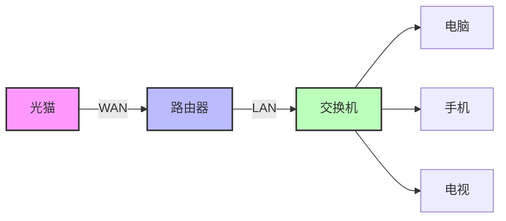
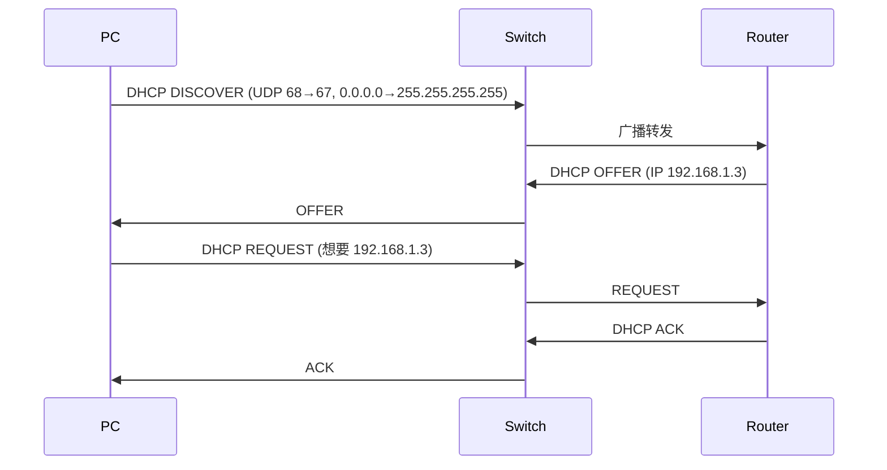
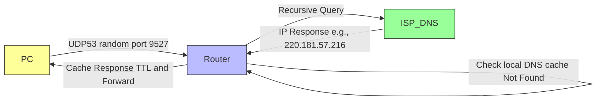

## 先搭个舞台：家里常见的网络拓扑

```
[光猫]──WAN──[路由器]──LAN──[交换机]──>PC/手机/电视…
```

* **光猫**：运营商提供的“光纤入口”。
* **路由器 WAN 口**：通过 PPPoE 或光猫直接拨号，获得 **公网 IP**（比如 `2.2.2.2`）。
* **路由器 LAN 口 + 交换机**：内部网络的 **网关**，默认 IP `192.168.1.1`。
* **交换机**：只识别 **MAC**，把数据转到对应的端口。

> **Mermaid 拓扑图**



---

## DHCP：给电脑分配“身份证”

**DHCP**（Dynamic Host Configuration Protocol）是 **“自动领身份证”** 的服务，流程大致是：

| 步骤               | 发起者                | 目的                     | 关键端口                 | 关键地址                                        |
| ------------------ | --------------------- | ------------------------ | ------------------------ | ----------------------------------------------- |
| **DISCOVER** | PC（DHCP 客户端）     | “谁能给我身份证？”     | src: 68 → dst: 67 (UDP) | srcIP: 0.0.0.0 → dstIP: 255.255.255.255 (广播) |
| **OFFER**    | 路由器（DHCP 服务器） | “给你这个 IP”          | src: 67 → dst: 68       | srcIP: 192.168.1.1 → dstIP: 255.255.255.255    |
| **REQUEST**  | PC                    | “我想要这个 IP”        | src: 68 → dst: 67       | srcIP: 0.0.0.0 → dstIP: 192.168.1.1            |
| **ACK**      | 路由器                | “好，身份证已经发给你” | src: 67 → dst: 68       | srcIP: 192.168.1.1 → dstIP: 192.168.1.x        |

> **Mermaid 时序图**



**关键点**

* 客户端 **没有 IP**，只能用 `0.0.0.0` 作为源 IP。
* **广播** (`255.255.255.255` + `ff:ff:ff:ff:ff:ff`) 确保所有设备都能收到。
* 路由器把 **可用 IP**（比如 `192.168.1.3`）连同子网掩码、网关、DNS 返回给 PC。

> **如果 DHCP 服务器挂掉** → PC 会自动切换到 **APIPA** (169.254.x.x) 并提示 “获取不到IP”。

---

## ARP：找路由器的“门牌号”

在同一个局域网里，**IP** 只能用于逻辑定位，真正的“投递地址”是 **MAC**（48‑bit 物理地址）。
**ARP**（Address Resolution Protocol）负责把 `IP → MAC` 的对应关系搞定。

**典型 ARP 请求**（PC 询问路由器 MAC）

| 字段               | 内容                          |
| ------------------ | ----------------------------- |
| **源 IP**    | `192.168.1.3`               |
| **目标 IP**  | `192.168.1.1`               |
| **源 MAC**   | `CC:CC:CC:CC:CC:CC`         |
| **目标 MAC** | `FF:FF:FF:FF:FF:FF`（广播） |

路由器收到后 **单播** 回应：

```
src MAC = BB:BB:BB:BB:BB:BB (路由器)
dst MAC = CC:CC:CC:CC:CC:CC (电脑)
src IP = 192.168.1.1
dst IP = 192.168.1.3
```

> **ARP 记录** 在每台设备的 **ARP 缓存** 里保存几分钟，省去重复广播。

---

## DNS：把人类友好的域名变成机器能读的 IP

**DNS**（Domain Name System）是“把 `baidu.com` 翻译成 `xxx.xxx.xxx.xxx`” 的服务。
流程简化如下（图中假设 PC 已经有路由器的 MAC）：

1. **PC → 路由器**：UDP 53（随机源端口 9527）
   *目标 IP = 路由器 LAN IP (`192.168.1.1`)*
2. **路由器**：查本地 DNS 缓存 → 没有 → **递归查询** 上游运营商 DNS。
3. **上游 DNS** → 回应 IP（比如 `220.181.57.216`）给路由器。
4. **路由器** 把响应 **缓存**（TTL）后 **转发** 给 PC。

> **Mermaid 流程图**



---

## 子网掩码 & CIDR：到底谁在同一个“圈子”里？

* **IP**：`192.168.1.3` → 二进制 `11000000.10101000.00000001.00000011`
* **子网掩码**：`255.255.255.0` → 二进制 `11111111.11111111.11111111.00000000`

子网掩码的 **1 位** 提取网络号，**0 位** 留给主机号。
**/24** 就是 “前 24 位是网络号”。

* 同网段判断：**只比较网络号**。

| IP            | 网络号 (`/24`) | 同网段? |
| ------------- | ---------------- | ------- |
| 192.168.1.3   | 192.168.1        | ✅      |
| 192.168.1.100 | 192.168.1        | ✅      |
| 192.168.2.5   | 192.168.2        | ❌      |
| 10.0.0.23     | 10.0.0           | ❌      |

**若不在同网段** → 把包交给 **默认网关**（路由器）去转发。

---

## NAT：把局域网的“小号”变成公网“大号”

路由器在把内部流量发往互联网时，会进行 **Network Address Translation (NAT)**：

| 方向           | 原始                                          | NAT 后                                                                         |
| -------------- | --------------------------------------------- | ------------------------------------------------------------------------------ |
| **出站** | srcIP =`192.168.1.3`<br/>srcPort = `9527` | srcIP =`WAN公网IP` (例 `2.2.2.2`)<br/>srcPort = 随机空闲端口 (例 `4134`) |
| **回程** | dstIP =`2.2.2.2`<br/>dstPort = `4134`     | dstIP =`192.168.1.3`<br/>dstPort = `9527`                                  |

路由器把 **映射关系** 存进 **NAT 表**，这样公网返回的数据就能“找回”原始主机。

> **Mermaid NAT 表**（简化）


---

## 完整案例：键入 `baidu.com` → 页面出现的全链路

下面把 **前面的所有技术点** 按时间顺序串起来，演示一次完整的“打开百度”之旅。

```
┌───────────┐   1. PC 开机、无 IP
│  PC (0.0.0.0)│  → DHCP DISCOVER (广播)  → Switch → Router
│   (CC…)   │   2. Router DHCP OFFER (192.168.1.3) → Switch → PC
│           │   3. PC DHCP REQUEST → Router
│           │   4. Router DHCP ACK → PC
│   (IP:192.168.1.3)  <--  完成 IP、子网掩码、网关、DNS 赋值
└─────▲─────┘
      │
      │   5. 浏览器输入 baidu.com → DNS Query (UDP 9527→53)
      │   → ARP 请求 (找路由器 MAC) → 路由器回应
      │   → DNS 报文到路由器
      │   → 路由器递归查询上游 DNS → 获得 220.181.57.216
      │   ← DNS Reply (UDP 53→9527) ← 路由器
      │   ← PC 收到 IP，缓存
      │
      ▼
┌───────────┐   6. 建立 TCP 连接 (srcPort=9527, dstPort=80)
│   PC      │   → 检查子网掩码 → 不同网段 → 发往网关 192.168.1.1
│ (srcMAC) │   → ARP 缓存已有 → 直接使用路由 MAC
│           │   → 发送 TCP SYN 到路由器 (srcIP=192.168.1.3)
└─────▲─────┘
      │
      │   7. 路由器 NAT：srcIP 192.168.1.3 → 2.2.2.2, srcPort 9527→4134
      │   → 把包送到互联网（经多跳路由）
      │   ← 百度服务器返回 HTTP 数据 (dstPort=4134)
      │   ← NAT 表映射回 192.168.1.3:9527
      │   ← 包回到 LAN，MAC 改为路由 LAN → PC
      ▼
┌───────────┐   8. 浏览器收到 HTTP 响应，渲染页面
│   PC      │   🎉 🎉 🎉
└───────────┘
```

> **要点回顾**
>
> * **DHCP** = “自动领身份证”。
> * **ARP** = “找门牌”。
> * **DNS** = “把人类语言翻译成 IP”。
> * **子网掩码** = “谁和谁是一家人”。
> * **NAT** = “让局域网的私人号码能跑进公网”。

---

## 常见坑 & 小技巧

| 场景                                     | 现象                                      | 可能原因                           | 快速定位                                                | 解决办法                                           |
| ---------------------------------------- | ----------------------------------------- | ---------------------------------- | ------------------------------------------------------- | -------------------------------------------------- |
| **电脑拿不到 IP**                  | 169.254.x.x                               | DHCP 服务未启动 / IP 冲突          | `ipconfig /all` 看 DHCP Server 是否为 `192.168.1.1` | 重启路由器、检查 DHCP 开关、确认没有多台 DHCP 设备 |
| **访问网页很慢 / DNS 解析超时**    | `ERR_NAME_NOT_RESOLVED`                 | DNS 缓存失效、上游 DNS 不通        | `nslookup baidu.com` 观察返回 IP                      | 手动指定可靠 DNS（如 8.8.8.8）                     |
| **同一局域网设备互相 ping 不通**   | 全部返回 “Destination Host Unreachable” | 子网掩码错误 → 设备被划到不同子网 | 检查每台设备的子网掩码是否统一 `255.255.255.0`        | 统一子网掩码或重新分配 IP                          |
| **玩游戏/点对点业务卡顿**          | 延迟高、掉线                              | NAT 表满、端口映射冲突             | 登录路由查看 NAT/连接数                                 | 开启端口转发或开启 “UPnP”                        |
| **路由器内部网络能上网，外网不能** | 只能访问局域网资源                        | WAN 口没有公网 IP / PPPoE 拨号错误 | 检查路由状态页的 WAN IP                                 | 重新拨号或联系运营商                               |

**小技巧**

1. **ARP 缓存清理**：`arp -d *`（Windows）或 `sudo ip -s neigh flush all`（Linux）。
2. **DHCP 静态绑定**：在路由器里把 **MAC → 固定 IP** 绑定，防止 IP “摇摆”。
3. **DNS 缓存时间**：TTL 过期前，设备会继续使用本地缓存，故 DNS 改动有延迟。
