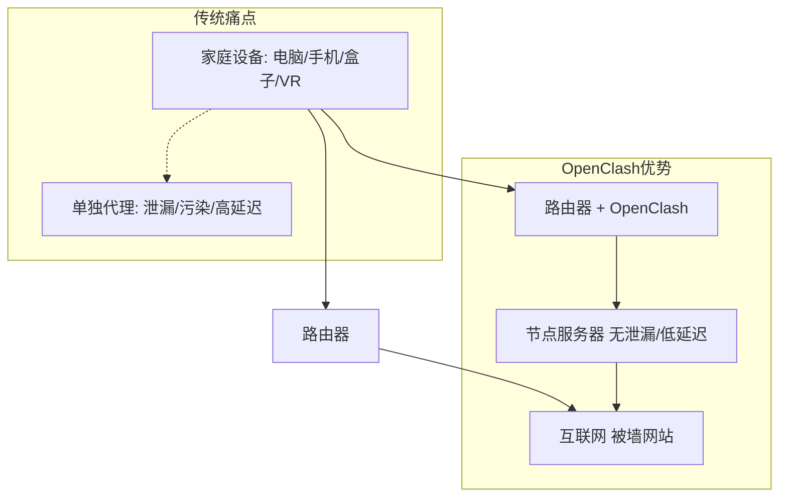
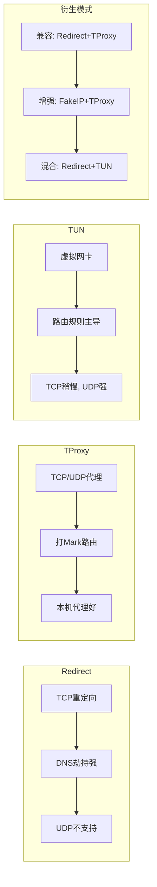
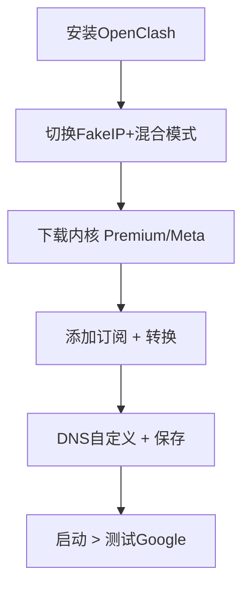
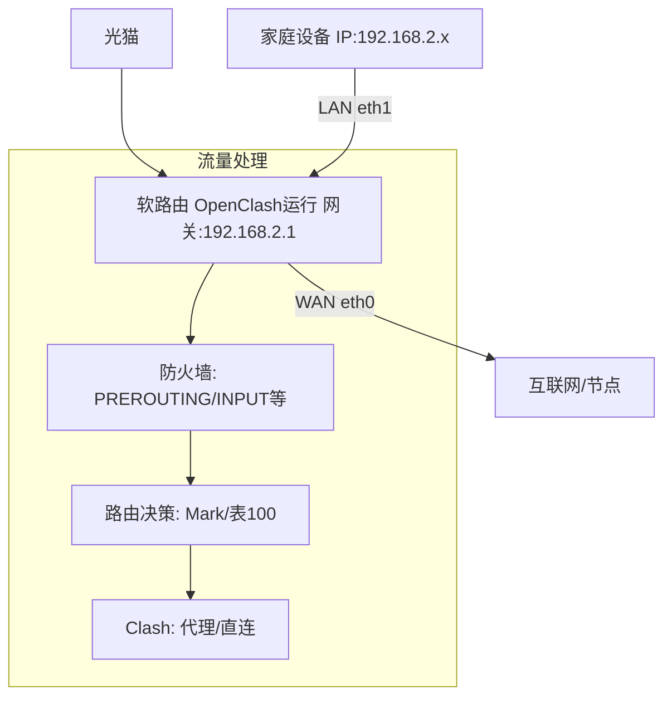

今天我们来深入浅出地聊聊OpenClash这个强大的OpenWRT插件。如果你是个软路由新手，想实现全家科学上网（翻墙），却又纠结于DNS泄漏、流量污染、延迟高企的问题，这篇教程就是你的救星。我们将用教学风格，从零起步，一步步拆解：为什么需要OpenClash？OpenClash是什么及其核心模式？以及如何配置实现无污染无泄漏的优化上网。读完后，你能自信地搞定自己的网络环境。注意，本教程基于ImmortalWRT 23.05固件（或类似），当前OpenClash最新版本为v0.47.024（2024年10月27日发布，修复了多项bug，建议从GitHub下载最新内核）。 走起！

## 为什么需要OpenClash？

先来聊聊为什么会有OpenClash这个插件。想象你的家庭网络：路由器连光猫，设备通过PPPoE拨号上网。但访问Google、YouTube等被墙网站时，总有痛点：

* **传统代理的局限**：手机/电脑上跑Clash或V2Ray，能科学上网，但电视盒子、VR头显不支持代理工具，导致激活失败或无法看视频。全家设备单独配置，太麻烦！
* **污染与泄漏风险**：DNS请求泄露给运营商，可能被检测；流量污染（国内网站走代理）增加延迟，响应慢；UDP流量（如QUIC）处理不当，丢包或无法代理。
* **性能问题**：硬路由功能固定，无法优化。软路由上跑代理插件，能实现透明代理，但配置不当易漏流量、污染规则，影响跨境电商或隐私需求。

OpenClash的出现，就是为了解决这些：它在路由器层运行Clash内核，实现无污染（白名单模式，直连国内网站）、无泄漏（DNS劫持）、低延迟（优化路由决策）。结果？全家设备连路由器即科学上网，响应速度提升，隐私更安全。尤其适合新手，避免“看不懂教程就入睡”的尴尬。

为了直观，这里用Mermaid图展示传统网络痛点 vs. OpenClash解决方案：

如图，OpenClash像网络“智能卫士”，统一处理流量，省心高效。

## 什么是OpenClash？

OpenClash是OpenWRT上的Clash插件，专为科学上网设计。它运行Clash内核（Premium/Meta），通过防火墙（iptables/nftables）和路由规则，实现透明代理。核心是三种代理方式：Redirect、TProxy、TUN，以及衍生模式：兼容模式、增强模式、混合模式。它们解决不同场景的TCP/UDP代理、DNS劫持、路由决策问题。

* **Redirect模式**：重定向TCP流量到Clash端口（默认7892），适合DNS劫持和简单TCP代理。但无法处理UDP（无连接，无法获取原始目标），易漏UDP流量如QUIC。
* **TProxy模式**：用透明代理模块处理TCP/UDP，打Mark（标签）并路由到Clash（默认7895）。支持UDP，但需防火墙规则，兼容本机代理。
* **TUN模式**：创建虚拟网卡（utun），通过路由规则（不依赖防火墙）代理流量。高效，但TCP性能稍逊Redirect；用System/gVisor协议栈解析数据。

衍生模式：

* **兼容模式**：Redirect + TProxy，代理TCP用Redirect，UDP用TProxy。
* **增强模式**：FakeIP + TProxy，提升DNS处理，避免污染。
* **混合模式**：Redirect (TCP) + TUN (UDP)，平衡性能与兼容，推荐新手。

路由决策：用路由表（ip rule/route）+防火墙链（PREROUTING/INPUT/OUTPUT/FORWARD/POSTROUTING）拦截/重定向数据。FakeIP模式（推荐）用虚拟IP防泄漏；Redir-Host模式弃用，除非用Meta内核。

模式区别用Mermaid表格展示：

总之，OpenClash是“路由级Clash”，通过这些模式+防火墙，实现无污染（白名单直连）无泄漏（DNS上游自定义）。

## 如何配置OpenClash？

好了，实战时间！本节分小白配置（跟操作）和进阶配置（懂原理）。前提：软路由上网正常，其他插件关闭。固件ImmortalWRT 23.05，OpenClash v0.47.024（检查更新）。

### 小白配置：一步步上手

1. **安装与启动**：LuCI > 服务 > OpenClash。取消内核安装提示，切换FakeIP模式，运行模式选混合（旁路由勾LAN IP动态伪装）。
2. **下载内核**：插件设置 > 版本更新 > 检查并更新（Premium）。若下载失败，覆写设置改CDN地址（如ghproxy.com/raw）。
3. **添加订阅**：配置订阅 > 添加 > 贴机场链接（Clash格式直接保存，非Clash勾在线转换）。推荐专线机场（高速稳定）。更新配置。
4. **DNS优化**：DNS设置 > 自定义上游DNS + 追加上游。开发者选项删井号前代码，保存。
5. **启动测试**：日志显示启动成功，主界面绿色“运行中”。关代理工具，访Google。进入Web面板切换节点。

配置流程图：

这样，无污染无泄漏，低延迟上网就成了！响应速度提升明显。

### 进阶配置：白名单 + 自定义规则

为隐私高要求（如电商），用白名单防检测：

1. **改模板**：配置订阅 > 编辑 > 自定义模板（用视频模板，链接在描述）。更新配置，直连国内网站。
2. **自定义直连**：配置管理 > 规则及文件 > 新建文件（e.g., Windows），加域名（支持\*通配）。规则附加 > 添加 > File > Domain > Direct。
3. **应用规则**：保存应用，重启。控制面板查连接（直连/代理）。小众网站加书签编辑，即时生效。

防火墙/路由检查：

* nft list ruleset 或 iptables -t nat -L 查看链。
* ip a 查utun虚拟网卡。
* ip rule / ip route 查路由表。
* TUN需开启IP转发（cat /proc/sys/net/ipv4/ip_forward 为1）。

进阶思考：Redirect/TProxy代理局域网设备，无需IP转发；TUN需开启。

网络拓扑图（主路由模式）：

恭喜！你现在是OpenClash高手。遇到bug？查日志，重启路由。若教程帮到你，欢迎分享经历。我们下次见，继续网络进阶！
